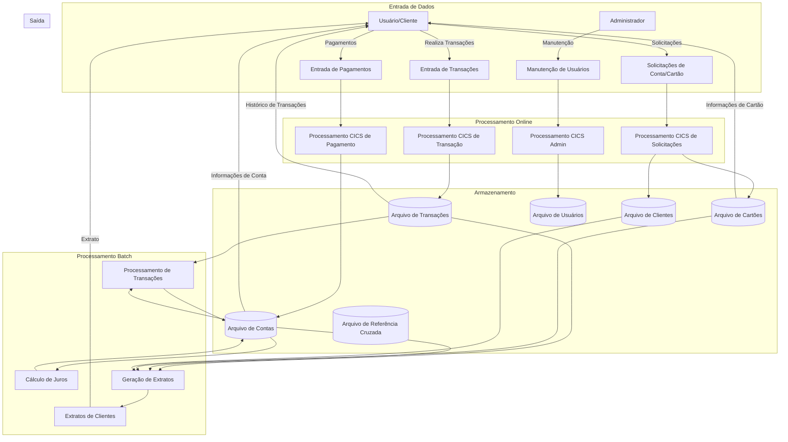
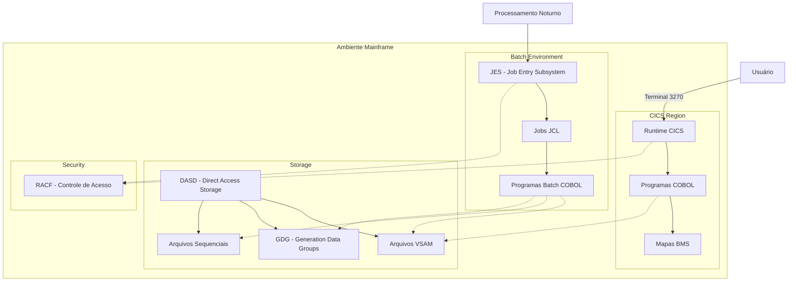

# Análise Executiva e Técnica da Aplicação – AWS CardDemo Cobol

## Resumo do Documento

Este documento apresenta os resultados da análise do código-fonte da aplicação AWS CardDemo Cobol, incluindo:
- **Visão Executiva:** Propósito, funcionamento e benefícios.
- **Visão Técnica:** Arquitetura, tecnologias, componentes e diagramas.
- **Visão de Produto:** Funcionalidades, usuários e casos de uso.
- **Visões Complementares:** Testes, segurança, dependências, estrutura do projeto, observabilidade e performance.
- **Limitações da Análise:** Obstáculos identificados na análise.
- **Recomendações Finais:** Ações sugeridas com base na análise.

## 1. Visão Executiva

### 1.1. Propósito da Aplicação

A aplicação AWS CardDemo é um sistema bancário de gerenciamento de cartões de crédito projetado para demonstrar cenários de código mainframe em processos de análise, transformação e migração. Seu objetivo principal é servir como uma aplicação de referência que exercita diversos aspectos técnicos de sistemas legados em mainframe, incluindo processamento online e batch, para facilitar testes de migração e modernização.

Seu propósito específico de negócio é permitir o gerenciamento completo do ciclo de vida de cartões de crédito, incluindo:
- Gerenciamento de contas e cartões
- Processamento de transações
- Geração de relatórios e extratos
- Gestão de clientes e segurança de usuários
- Cálculo de juros e faturamento

### 1.2. Funcionamento Geral (Alto Nível)

O sistema CardDemo opera como uma aplicação mainframe tradicional com dois grandes componentes:

1. **Sistema Online (CICS)**: Interface para usuários finais e administradores, permitindo:
   - Autenticação de usuários (regulares e administradores)
   - Visualização e atualização de contas e cartões
   - Listagem e processamento de transações
   - Pagamento de faturas
   - Gerenciamento de usuários (funções administrativas)

2. **Sistema Batch**: Processamento em lote de operações como:
   - Processamento de transações diárias
   - Cálculo de juros
   - Geração de extratos
   - Manutenção de arquivos-mestre
   - Backup e restauração de dados

O fluxo típico de operação envolve a entrada de transações através da interface CICS, armazenamento em arquivos VSAM, processamento noturno em batch, e atualização dos arquivos-mestre para refletir os novos saldos e situações de conta.

### 1.3. Regras de Negócio Identificadas

Através da análise do código Cobol, foram identificadas as seguintes regras de negócio principais:

1. **Autenticação e Autorização**:
   - Existem dois tipos de usuários: Administradores (`ADMIN001`) e Usuários Regulares (`USER0001`)
   - Cada tipo de usuário possui diferentes níveis de acesso e menus específicos
   - Usuários devem fornecer ID e senha para acesso

2. **Gerenciamento de Contas**:
   - Contas possuem limites de crédito totais e limites específicos para saque em dinheiro
   - Contas possuem datas de abertura, expiração e reemissão
   - Controle de status ativo/inativo para contas

3. **Cartões de Crédito**:
   - Cartões estão vinculados a contas e clientes
   - Cartões possuem números de 16 dígitos, códigos CVV e datas de expiração
   - Cada cartão tem um status ativo/inativo
   - Um cliente pode ter múltiplos cartões

4. **Transações**:
   - Transações possuem categorias e tipos específicos
   - Existem regras para processamento de diferentes tipos de transações
   - As transações afetam o saldo da conta conforme seu tipo
   - Existem transações de débito e crédito

5. **Processamento Financeiro**:
   - Cálculo de juros baseado no saldo da conta
   - Regras de ciclo de faturamento
   - Processamento de pagamentos

6. **Relatórios e Consultas**:
   - Geração de extratos de transações
   - Relatórios de atividade por período
   - Consultas de saldo e transações

### 1.4. Benefícios Estratégicos

A aplicação CardDemo, em seu estado atual, oferece os seguintes benefícios estratégicos:

1. **Operação Completa de Cartões**: Fornece todas as funções essenciais para operação de um sistema de cartões de crédito.

2. **Integração com Sistemas Legados**: Construída para integrar-se aos sistemas tradicionais de mainframe.

3. **Confiabilidade**: Utiliza tecnologias mainframe maduras (COBOL, CICS, VSAM) conhecidas por sua estabilidade.

4. **Funcionalidade Batch e Online**: Oferece tanto operações em tempo real quanto processamento em lote para operações intensivas.

5. **Segurança Básica**: Implementa controles de acesso baseados em perfis de usuário.

6. **Separação de Responsabilidades**: Clara distinção entre funções administrativas e operacionais.

7. **Modelo de Dados Estruturado**: Utiliza um esquema de dados bem definido para gerenciar informações críticas.

## 2. Visão Técnica

### 2.1. Arquitetura do Sistema

A aplicação CardDemo segue uma arquitetura monolítica tradicional de mainframe, dividida em dois componentes principais:

1. **Componente Online (CICS)**:
   - Arquitetura de apresentação baseada em BMS (Basic Mapping Support)
   - Programas de transação CICS para processamento online
   - Menus e telas para diferentes funcionalidades
   - Acesso a arquivos VSAM compartilhados

2. **Componente Batch**:
   - Jobs JCL para processamento em lote
   - Programas Cobol para processamento de transações em massa
   - Utilização de utilitários como SORT, IDCAMS para manipulação de dados
   - Sequência definida de execução de jobs

O sistema é estruturado como um conjunto de programas Cobol que compartilham arquivos de dados VSAM. A comunicação entre os programas CICS ocorre principalmente através de transferências de controle (XCTL) e passagem de dados via COMMAREA.

### 2.2. Tecnologias Utilizadas

A aplicação utiliza as seguintes tecnologias:

1. **Linguagens e Ambientes**:
   - **COBOL**: Linguagem principal de programação
   - **CICS**: Sistema de processamento de transações online
   - **JCL**: Linguagem de controle de jobs para processamento batch

2. **Armazenamento de Dados**:
   - **VSAM**: Virtual Storage Access Method para armazenamento de dados
   - **Arquivos sequenciais**: Para dados de entrada/saída em batch
   - **GDG (Generation Data Groups)**: Para versionamento de arquivos

3. **Interface de Usuário**:
   - **BMS (Basic Mapping Support)**: Para definição de telas e mapas
   - **Mapsets CICS**: Definições de tela para interfaces de usuário

4. **Segurança**:
   - **RACF** (mencionado no README): Para autenticação e autorização de usuários

5. **Utilitários**:
   - **IDCAMS**: Para manipulação de arquivos VSAM
   - **IEBGENER**: Para cópia e manipulação de arquivos
   - **SORT**: Para classificação e processamento de dados

### 2.3. Componentes-Chave e Fluxos

#### Componentes-Chave:

1. **Programas CICS Online**:
   - **COSGN00C**: Tela de login e autenticação
   - **COMEN01C**: Menu principal para usuários regulares
   - **COADM01C**: Menu administrativo
   - **COCRDLIC**: Listagem de cartões de crédito
   - **COCRDUPC**: Atualização de cartões
   - **COACTVWC**: Visualização de contas
   - **COACTUPC**: Atualização de contas
   - **COTRN00C/01C/02C**: Gerenciamento de transações
   - **COBIL00C**: Pagamento de faturas
   - **COUSR00C/01C/02C/03C**: Gerenciamento de usuários (admin)

2. **Programas Batch**:
   - **CBTRN02C**: Processamento de transações
   - **CBACT04C**: Cálculo de juros
   - **CBSTM03A**: Geração de extratos

3. **Copybooks Principais**:
   - **CVACT01Y**: Estrutura de dados de conta
   - **CVACT02Y**: Estrutura de dados de cartão
   - **CVCUS01Y**: Estrutura de dados de cliente
   - **CVACT03Y**: Referência cruzada entre cartão/conta/cliente
   - **CVTRA05Y**: Estrutura de registro de transação
   - **CSUSR01Y**: Estrutura de dados de usuários

4. **JCLs Essenciais**:
   - **ACCTFILE, CARDFILE, CUSTFILE**: Carga de arquivos-mestre
   - **POSTTRAN**: Processamento principal de transações
   - **INTCALC**: Cálculo de juros
   - **CREASTMT**: Geração de extratos

#### Fluxos Principais:

1. **Fluxo de Login e Autenticação**:
   - Usuário acessa a transação CC00
   - COSGN00C verifica credenciais no arquivo USRSEC
   - Direciona para COMEN01C (usuário regular) ou COADM01C (administrador)

2. **Fluxo de Gerenciamento de Cartões**:
   - Usuário seleciona opção no menu principal
   - COCRDLIC lista cartões disponíveis
   - Usuário pode visualizar detalhes (COCRDSLC) ou atualizar (COCRDUPC)

3. **Fluxo de Processamento de Transações Batch**:
   - Transações são coletadas durante o dia
   - Job POSTTRAN processa as transações em lote
   - Atualizações são aplicadas às contas
   - INTCALC calcula juros quando aplicável
   - CREASTMT gera extratos para os clientes

### 2.4. Complexidade e Qualidade de Código

A análise do código Cobol revelou os seguintes aspectos:

#### Complexidade:
- **Programas com alta coesão funcional**: Cada programa realiza um conjunto específico de funções.
- **Complexidade ciclomática moderada a alta**: Muitas condicionais e lógica de negócio incorporada no código.
- **Programas grandes**: Alguns módulos batch como CBACT04C (cálculo de juros) são extensos (>50K linhas).

#### Qualidade:
- **Nomenclatura consistente**: Prefixos padronizados para tipos de programas (CO para CICS online, CB para batch).
- **Comentários limitados**: Documentação interna mínima, principalmente cabeçalhos e descrições básicas.
- **Copybooks bem estruturados**: Definições de dados claras e organizadas.

#### Code Smells:
- **Duplicação de código**: Rotinas similares repetidas em múltiplos programas.
- **Lógica de negócio entrelaçada com I/O**: Falta de separação entre lógica de negócio e acesso a dados.
- **Erros tratados de forma inconsistente**: Diferentes abordagens para tratamento de exceções.
- **Variação de estilos de codificação**: Mencionado no README que o estilo não é uniforme para exercitar ferramentas de análise.

### 2.5. Diagramas Técnicos

#### Diagrama de Componentes

```mermaid
graph TB
    subgraph "Interface CICS (Online)"
        LOGIN[COSGN00C - Login] --> |Autenticação| AUTH{Autenticação}
        AUTH -->|Admin| ADMIN[COADM01C - Menu Admin]
        AUTH -->|Usuário Regular| MENU[COMEN01C - Menu Principal]
        
        ADMIN --> USERMGMT[Gerenciamento de Usuários]
        USERMGMT --> USERLIST[COUSR00C - Listar Usuários]
        USERMGMT --> USERADD[COUSR01C - Adicionar Usuário]
        USERMGMT --> USERUPD[COUSR02C - Atualizar Usuário]
        USERMGMT --> USERDEL[COUSR03C - Excluir Usuário]
        
        MENU --> ACCTMGMT[Gerenciamento de Contas]
        ACCTMGMT --> ACCTVIEW[COACTVWC - Visualizar Conta]
        ACCTMGMT --> ACCTUPD[COACTUPC - Atualizar Conta]
        
        MENU --> CARDMGMT[Gerenciamento de Cartões]
        CARDMGMT --> CARDLIST[COCRDLIC - Listar Cartões]
        CARDLIST --> CARDVIEW[COCRDSLC - Visualizar Cartão]
        CARDLIST --> CARDUPD[COCRDUPC - Atualizar Cartão]
        
        MENU --> TRANMGMT[Gerenciamento de Transações]
        TRANMGMT --> TRANLIST[COTRN00C - Listar Transações]
        TRANMGMT --> TRANVIEW[COTRN01C - Ver Transação]
        TRANMGMT --> TRANADD[COTRN02C - Adicionar Transação]
        TRANMGMT --> TRANRPT[CORPT00C - Relatórios]
        
        MENU --> BILLPAY[COBIL00C - Pagamento de Fatura]
    end
    
    subgraph "Batch Processing"
        POSTTRAN[CBTRN02C - Processamento de Transações]
        INTCALC[CBACT04C - Cálculo de Juros]
        STMTGEN[CBSTM03A - Geração de Extratos]
        BACKUP[TRANBKP - Backup de Transações]
        COMBTRAN[Combinar Transações]
    end
    
    subgraph "Dados"
        VSAM[(Arquivos VSAM)]
        SEQFILES[(Arquivos Sequenciais)]
        GDG[(GDG - Dados Versionados)]
    end
    
    %% Conexões entre componentes
    LOGIN -.-> VSAM
    USERMGMT -.-> VSAM
    ACCTMGMT -.-> VSAM
    CARDMGMT -.-> VSAM
    TRANMGMT -.-> VSAM
    BILLPAY -.-> VSAM
    
    POSTTRAN --> VSAM
    POSTTRAN --> SEQFILES
    INTCALC --> VSAM
    STMTGEN --> VSAM
    STMTGEN --> GDG
    BACKUP --> VSAM
    BACKUP --> GDG
    COMBTRAN --> SEQFILES
    COMBTRAN --> VSAM
```


#### Diagrama de Fluxo de Dados


#### Diagrama de Implantação/Infraestrutura


## 3. Visão de Produto

### 3.1. Funcionalidades Identificadas

Com base na análise do código e documentação, a aplicação CardDemo oferece as seguintes funcionalidades:

1. **Gerenciamento de Contas**:
   - Visualização de detalhes da conta (saldos, limites, datas)
   - Atualização de informações da conta
   - Consulta de histórico e status

2. **Gerenciamento de Cartões**:
   - Listagem de cartões disponíveis
   - Visualização de detalhes do cartão
   - Atualização de informações do cartão
   - Visualização de cartões por conta

3. **Gerenciamento de Transações**:
   - Listagem de transações
   - Visualização detalhada de transações
   - Inserção de novas transações
   - Filtros e consultas por período ou tipo

4. **Relatórios de Transações**:
   - Geração de relatórios por período
   - Exportação de dados
   - Consultas analíticas

5. **Pagamento de Faturas**:
   - Registro de pagamentos
   - Ajuste de saldos de conta
   - Confirmação de pagamentos

6. **Administração de Usuários**:
   - Listagem de usuários do sistema
   - Adição de novos usuários
   - Atualização de dados de usuários
   - Exclusão de usuários
   - Gerenciamento de perfis e permissões

7. **Processamento Batch**:
   - Processamento em lote de transações
   - Cálculo de juros sobre saldos
   - Geração de extratos mensais
   - Manutenção e backup de dados

### 3.2. Usuários e Perfis de Uso

A aplicação foi desenvolvida para dois tipos principais de usuários:

1. **Usuários Regulares** (perfil `USER0001`):
   - Funcionários de back-office bancário
   - Operadores de atendimento ao cliente
   - Analistas financeiros
   - Responsáveis pelo processamento diário

   **Principais atividades**:
   - Gerenciamento de contas e cartões
   - Visualização e entrada de transações
   - Processamento de pagamentos
   - Geração de relatórios
   - Atendimento a solicitações de clientes

2. **Usuários Administradores** (perfil `ADMIN001`):
   - Administradores de sistema
   - Gerentes de segurança
   - Supervisores de operação

   **Principais atividades**:
   - Gerenciamento de usuários do sistema
   - Configuração de permissões
   - Manutenção e monitoramento do sistema
   - Resolução de problemas críticos

### 3.3. Problemas que Resolve / Necessidades Atendidas

A aplicação CardDemo resolve as seguintes necessidades de negócio:

1. **Para Instituições Financeiras**:
   - Gerenciamento completo do ciclo de vida de cartões de crédito
   - Processamento eficiente de transações em grande volume
   - Controle de limites e saldos de contas
   - Segurança no acesso a informações sensíveis
   - Rastreabilidade de operações financeiras
   - Geração de extratos e relatórios para clientes e auditoria

2. **Para Clientes de Cartão (indiretamente)**:
   - Registro e controle de transações
   - Processamento correto de faturas e pagamentos
   - Transparência nas informações de conta
   - Segurança nas operações financeiras

3. **Para Operadores do Sistema**:
   - Interface estruturada para gerenciamento de operações
   - Separação clara de responsabilidades por perfil
   - Ferramentas para resolução de problemas e consultas
   - Processamento batch para operações volumosas e demoradas

### 3.4. Principais Casos de Uso ou Jornadas do Usuário

#### Jornada 1: Usuário Regular - Processamento de Transações
1. Login no sistema com credenciais de usuário regular
2. Acesso ao menu principal
3. Seleção da opção "Transaction Add"
4. Entrada de dados da transação (cartão, valor, estabelecimento)
5. Confirmação e salvamento da transação
6. Verificação do saldo atualizado da conta

#### Jornada 2: Usuário Regular - Consulta de Cartão
1. Login no sistema com credenciais de usuário regular
2. Acesso ao menu principal
3. Seleção da opção "Credit Card List"
4. Aplicação de filtros (opcional)
5. Visualização da lista de cartões
6. Seleção de um cartão específico para detalhes
7. Visualização de informações detalhadas do cartão

#### Jornada 3: Usuário Regular - Pagamento de Fatura
1. Login no sistema com credenciais de usuário regular
2. Acesso ao menu principal
3. Seleção da opção "Bill Payment"
4. Seleção da conta/cartão
5. Entrada do valor de pagamento
6. Confirmação do pagamento
7. Atualização do saldo da conta

#### Jornada 4: Administrador - Gerenciamento de Usuários
1. Login no sistema com credenciais de administrador
2. Acesso ao menu administrativo
3. Seleção da opção "User List"
4. Visualização dos usuários do sistema
5. Seleção da ação desejada (adicionar, atualizar, excluir)
6. Entrada/modificação dos dados do usuário
7. Salvamento das alterações

### 3.5. Domínios de Negócio Envolvidos

A aplicação CardDemo envolve os seguintes domínios de negócio:

1. **Cartões de Crédito**:
   - Emissão e gerenciamento de cartões
   - Associação de cartões a contas e clientes
   - Definição de limites e condições

2. **Contas Financeiras**:
   - Gestão de saldos e limites
   - Controle de ciclos de faturamento
   - Histórico de movimentações

3. **Transações Financeiras**:
   - Captura e processamento de transações
   - Categorização de transações
   - Registro de estabelecimentos comerciais

4. **Gerenciamento de Clientes**:
   - Dados cadastrais de clientes
   - Associação de clientes a produtos
   - Histórico de relacionamento

5. **Segurança e Acesso**:
   - Autenticação de usuários
   - Controle de perfis e permissões
   - Segregação de funções administrativas

6. **Relatórios e Compliance**:
   - Geração de extratos
   - Relatórios gerenciais
   - Auditoria de operações

## 4. Visão de Testes

### 4.1. Frameworks e Tipos de Testes

A análise do código fonte não revelou evidências explícitas de frameworks de teste formais ou testes automatizados integrados à aplicação. No entanto, foram observados os seguintes aspectos relacionados a testes:

1. **Dados de Teste**:
   - Existem arquivos de dados de exemplo na pasta `data`
   - Instruções no README para carga inicial destes dados para teste

2. **JCLs para Inicialização**:
   - JCLs específicos para configurar o ambiente de teste
   - Sequência documentada para preparar o ambiente

3. **Testes Manuais**:
   - Interface do usuário com entradas padronizadas
   - Mensagens de erro para validação de entradas
   - Fluxos bem definidos para teste manual

4. **Verificações em Tempo de Execução**:
   - Validações de entrada implementadas no código
   - Tratamento de condições de erro específicas
   - Códigos de resposta de operações CICS verificados

### 4.2. Nível de Cobertura Estimada

Sem ferramentas formais de teste, a cobertura é estimada de forma qualitativa:

1. **Áreas bem cobertas (por validações no código)**:
   - Validação de entrada de usuário
   - Acesso a arquivos VSAM (tratamento de erros)
   - Fluxos principais de negócio

2. **Áreas com cobertura limitada**:
   - Cenários de borda e casos extremos
   - Processamento batch (sem validações extensivas)
   - Integração entre subsistemas
   - Recuperação de falhas

3. **Áreas críticas sem evidência de testes estruturados**:
   - Cálculo de juros
   - Processamento de transações em grande volume
   - Cenários de concorrência
   - Compatibilidade entre versões

### 4.3. Observações sobre Testabilidade

A testabilidade do código Cobol apresenta os seguintes aspectos:

1. **Desafios para Testabilidade**:
   - Forte acoplamento entre lógica de negócio e acesso a dados
   - Dependência de ambiente CICS para programas online
   - Falta de modularização para isolar componentes
   - Uso extensivo de variáveis globais de trabalho
   - Ausência de interfaces bem definidas entre componentes

2. **Aspectos Positivos para Testabilidade**:
   - Estrutura de programas com pontos de entrada claros
   - Verificações de código de resposta após operações críticas
   - Estruturas de dados bem documentadas nos copybooks
   - Separação entre programas online e batch

3. **Recomendações para Melhoria**:
   - Implementar injeção de dependências para facilitar o teste unitário
   - Criar stubs para simular acessos a VSAM e CICS
   - Separar lógica de negócio de I/O
   - Implementar estruturas de log para rastreamento de execução

## 5. Visão de Segurança

### 5.1. Vulnerabilidades Potenciais ou Mecanismos de Segurança

A aplicação CardDemo implementa os seguintes mecanismos de segurança:

1. **Autenticação de Usuários**:
   - Sistema de login com ID e senha
   - Validação contra arquivo VSAM de usuários (USRSEC)
   - Distinção entre perfis de administrador e usuário regular

2. **Autorização**:
   - Menus diferentes para tipos diferentes de usuários
   - Verificação de tipo de usuário antes de operações críticas
   - Separação entre funções administrativas e operacionais

3. **Validação de Entrada**:
   - Verificação de campos obrigatórios
   - Validação de formato para campos críticos
   - Mensagens de erro para entradas inválidas

Vulnerabilidades potenciais identificadas:

1. **Armazenamento de Senhas**:
   - Senhas armazenadas aparentemente em texto claro (não há evidência de hash)
   - Senhas visíveis durante a digitação na interface

2. **Controle de Acesso**:
   - Granularidade limitada de permissões (apenas dois perfis principais)
   - Sem controle de tentativas de login ou bloqueio após falhas

3. **Validação de Dados**:
   - Validação inconsistente em diferentes programas
   - Potencial para injeção de dados em algumas entradas

4. **Segurança no Transporte**:
   - Não há evidência de criptografia para dados em trânsito
   - Dependência do ambiente mainframe para segurança de rede

### 5.2. Dependências (Copybooks, Utilitários) e Segurança

As dependências críticas relacionadas à segurança incluem:

1. **CSUSR01Y.cpy**:
   - Define a estrutura de registro de usuário
   - Contém campos para senha sem indicação de criptografia
   - Essencial para o processo de autenticação

2. **COSGN00.cpy**:
   - Define os mapas de tela para o processo de login
   - Contém campos para entrada de credenciais

3. **RACF**:
   - Mencionado no README como tecnologia utilizada
   - Não há evidências claras de como a integração é feita no código

### 5.3. Boas Práticas de Segurança Mainframe

A aplicação implementa algumas práticas de segurança típicas de mainframe:

1. **Separação de Ambientes**:
   - Distinção entre ambiente online e batch
   - Arquivos fechados durante processos batch críticos

2. **Controle de Acesso**:
   - Uso implícito de RACF para segurança do mainframe
   - Validação de credenciais antes do acesso a funções

3. **Mensagens de Erro Controladas**:
   - Mensagens de erro não revelam detalhes internos do sistema
   - Uso de mensagens padronizadas para erros comuns

Práticas ausentes ou não evidentes:

1. **Auditing**:
   - Falta de registro sistemático de ações de usuários
   - Ausência de trilhas de auditoria para ações críticas

2. **Criptografia**:
   - Falta de evidências de criptografia para dados sensíveis
   - Senhas e números de cartão possivelmente armazenados sem proteção

## 6. Visão de Dependências

### 6.1. Dependências Identificadas

#### Copybooks Centrais:

1. **Estruturas de Dados Principais**:
   - **CVACT01Y.cpy**: Definição de registro de conta (ACCT-RECORD)
   - **CVACT02Y.cpy**: Definição de registro de cartão (CARD-RECORD)
   - **CVCUS01Y.cpy**: Definição de registro de cliente (CUSTOMER-RECORD)
   - **CVACT03Y.cpy**: Definição de registro de referência cruzada (CARD-XREF-RECORD)
   - **CVTRA05Y.cpy**: Definição de registro de transação (TRAN-RECORD)
   - **CSUSR01Y.cpy**: Definição de registro de usuário (SEC-USER-DATA)

2. **Definições de Interface**:
   - **COSGN00.cpy**: Mapa BMS para tela de login
   - **COMEN01.cpy**: Mapa BMS para menu principal
   - **COADM01.cpy**: Mapa BMS para menu administrativo
   - **COCRDLI.cpy**: Mapa BMS para listagem de cartões
   - **COTRN00.cpy**: Mapa BMS para listagem de transações

3. **Utilitários e Constantes**:
   - **COCOM01Y.cpy**: Definição de área de comunicação comum
   - **CSDAT01Y.cpy**: Definições de data e hora
   - **CSMSG01Y.cpy**: Mensagens padronizadas
   - **COTTL01Y.cpy**: Definições de título

#### Utilitários Comuns do Mainframe:

1. **CICS**:
   - DFHAID.cpy: Definições de teclas de atenção
   - DFHBMSCA.cpy: Atributos de mapa BMS
   - DFHEIBLK: Bloco de comunicação CICS

2. **Utilitários de Sistema**:
   - IDCAMS: Para manipulação de arquivos VSAM
   - IEBGENER: Para manipulação de dados sequenciais
   - SORT: Para ordenação de dados

#### Outros Programas Chamados:

1. **Chamadas XCTL (transferência de controle)**:
   - COSGN00C → COMEN01C ou COADM01C
   - COMEN01C → Vários programas funcionais (COCRDLIC, COACTVWC, etc.)
   - COADM01C → Programas administrativos (COUSR00C, etc.)

2. **Encadeamento de Jobs Batch**:
   - CLOSEFIL → Diversos jobs de processamento → OPENFIL

### 6.2. Versões e Status (se aplicável)

O código fonte não contém informações explícitas sobre versões específicas das dependências, mas os comentários de controle de versão no final de alguns arquivos indicam:

```
Ver: CardDemo_v1.0-15-g27d6c6f-68 Date: 2022-07-19 23:15:59 CDT
```

Isso sugere que a aplicação está na versão 1.0 com algumas revisões após a tag principal.

Quanto às tecnologias mainframe:
- Não há referências específicas à versão do COBOL utilizada, mas a sintaxe é compatível com COBOL II ou superior
- CICS: Usa construções compatíveis com versões modernas de CICS
- VSAM: Utiliza recursos padrão de VSAM sem indicação de versão específica

### 6.3. Sugestões (se houver débito técnico relacionado)

1. **Centralização de Lógica Comum**:
   - Extrair rotinas comuns para módulos reutilizáveis
   - Eliminar duplicação de código entre programas similares

2. **Padronização de Tratamento de Erros**:
   - Criar copybook comum para tratamento de erros
   - Implementar rotinas consistentes para logging de erros

3. **Modularização de Copybooks**:
   - Dividir copybooks muito grandes em unidades mais gerenciáveis
   - Separar definições de interface das estruturas de dados

4. **Atualização de Técnicas CICS**:
   - Considerar uso de recursos CICS mais modernos
   - Revisar padrões de codificação para otimização

## 7. Visão de Estrutura de Projeto

### 7.1. Diretórios e Módulos

A aplicação CardDemo está organizada na seguinte estrutura:

```
app/
├── bms/         # Basic Mapping Support (definições de tela)
├── catlg/       # Catálogos para VSAM
├── cbl/         # Programas COBOL (fontes)
├── cpy/         # Copybooks (estruturas de dados)
├── cpy-bms/     # Copybooks gerados para BMS
├── csd/         # Definições de recursos CICS
├── ctl/         # Arquivos de controle
├── data/        # Dados de exemplo
├── jcl/         # JCLs para execução batch
└── proc/        # Procedimentos catalogados
```

Os programas são organizados em categorias funcionais:

1. **Programas Online (prefixo CO)**:
   - Programas de interface (telas e menus)
   - Programas de operação (transações específicas)
   - Programas de consulta e relatórios

2. **Programas Batch (prefixo CB)**:
   - Programas de processamento massivo
   - Programas de manutenção
   - Programas de geração de relatórios

3. **Arquivos de Suporte**:
   - JCLs para execução de jobs
   - Definições de mapas BMS
   - Procedimentos catalogados

### 7.2. Separação de Responsabilidades

A aplicação CardDemo demonstra a seguinte separação de responsabilidades:

1. **Separação Funcional**:
   - Módulos distintos para diferentes funções de negócio
   - Programas separados para administração e operação
   - Diferentes programas para diferentes entidades (cartões, contas, transações)

2. **Separação Técnica**:
   - Clara divisão entre programas online e batch
   - Separação entre definições de dados (copybooks) e lógica (programas)
   - Divisão entre interface (BMS) e processamento (COBOL)

3. **Limitações na Separação**:
   - Lógica de negócio e acesso a dados frequentemente misturados
   - Falta de camadas de abstração claras
   - Duplicação de lógica em diferentes programas

### 7.3. Estrutura de Configuração (JCLs, Parâmetros)

A configuração da aplicação CardDemo é gerenciada através de:

1. **JCLs**:
   - Arquivos JCL para cada operação batch principal
   - Sequência definida de execução (documentada no README)
   - Parâmetros para utilitários específicos

2. **Definições CICS (CSD)**:
   - Definições de recursos CICS no diretório CSD
   - Transações, programas, mapas e arquivos definidos para CICS

3. **Dados de Inicialização**:
   - Arquivos de dados iniciais para carga
   - Scripts para preparação do ambiente

4. **Limitações**:
   - Parâmetros hard-coded em programas
   - Falta de centralização de configurações
   - Dependência de procedimentos manuais para configuração inicial

## 8. Visão de Observabilidade

### 8.1. Logging e Instrumentação

A aplicação CardDemo implementa mecanismos limitados de logging e instrumentação:

1. **Mensagens de Erro**:
   - Mensagens de erro exibidas na interface do usuário
   - Códigos de resposta CICS capturados e processados
   - Mensagens formatadas para situações de erro específicas

2. **Rastreamento de Erros**:
   - Captura de códigos de resposta e razão de CICS
   - Variáveis WS-RESP-CD e WS-REAS-CD utilizadas para capturar erros
   - Avaliação de códigos de resposta para tratamento de exceções

3. **Limitações**:
   - Falta de um mecanismo centralizado de logging
   - Ausência de níveis de log (debug, info, error)
   - Instrumentação limitada para análise de performance
   - Logs de transações não são persistentes

Exemplo de captura de erro típica no código (de COSGN00C.cbl):
```cobol
EXEC CICS READ
     DATASET   (WS-USRSEC-FILE)
     INTO      (SEC-USER-DATA)
     LENGTH    (LENGTH OF SEC-USER-DATA)
     RIDFLD    (WS-USER-ID)
     KEYLENGTH (LENGTH OF WS-USER-ID)
     RESP      (WS-RESP-CD)
     RESP2     (WS-REAS-CD)
END-EXEC.

EVALUATE WS-RESP-CD
    WHEN 0
        [processamento normal]
    WHEN 13
        MOVE 'Y'      TO WS-ERR-FLG
        MOVE 'User not found. Try again ...' TO WS-MESSAGE
        [tratamento de erro]
    WHEN OTHER
        MOVE 'Y'      TO WS-ERR-FLG
        MOVE 'Unable to verify the User ...' TO WS-MESSAGE
        [tratamento de erro genérico]
END-EVALUATE.
```

### 8.2. Ferramentas de Monitoramento (se inferível)

O código não revela integração com ferramentas específicas de monitoramento, mas como sistema mainframe tradicional, provavelmente depende de:

1. **Monitoramento CICS**:
   - Ferramentas padrão de monitoramento CICS (CEMT, CEDF)
   - Estatísticas de transações CICS
   - Monitoramento de filas de transações

2. **Monitoramento Batch**:
   - Logs de execução de JCL
   - Códigos de retorno de jobs
   - Estatísticas de utilização de recursos

3. **Monitoramento de Sistema**:
   - Ferramentas nativas do mainframe (RMF, SMF)
   - Monitoramento de recursos de hardware
   - Alertas de limites de sistema

### 8.3. Mecanismos de Healthcheck ou Alertas (se existentes)

Não há evidências claras de mecanismos formais de healthcheck, mas são observáveis:

1. **Verificações Operacionais**:
   - JCLs para verificar status de arquivos (CLOSEFIL, OPENFIL)
   - Tratamento de erros para arquivos indisponíveis
   - Códigos de resposta para operações críticas

2. **Alertas Implícitos**:
   - Mensagens de erro para condições anormais
   - Códigos de retorno para jobs batch
   - Tratamento de exceções em operações CICS

3. **Limitações**:
   - Falta de healthchecks proativos
   - Ausência de alertas automatizados
   - Dependência de monitoramento manual

## 9. Visão de Performance

### 9.1. Potenciais Gargalos

A análise do código Cobol revelou os seguintes potenciais gargalos de performance:

1. **Acesso a Arquivos VSAM**:
   - Múltiplos acessos sequenciais a arquivos VSAM
   - Falta de otimização em operações de leitura repetitivas
   - Acesso sequencial para busca de registros em alguns casos

2. **Processamento de Transações**:
   - Operações de I/O intensivas durante processamento de transações
   - Potenciais contenções em atualizações concorrentes
   - Arquivos bloqueados durante processamento batch

3. **Grandes Volumes de Dados**:
   - Processamento de extratos pode ser intensivo para grandes números de transações
   - Ordenação de dados em memória para exibição em relatórios
   - Cálculos financeiros repetitivos em loop

4. **Interface CICS**:
   - Múltiplas operações CICS para processamento de telas
   - Potencial para bloqueios de terminal durante processamento
   - Sobrecarga em transações com alta taxa de I/O

### 9.2. Uso Ineficiente de Recursos (Mainframe)

Foram identificados os seguintes padrões de uso ineficiente de recursos:

1. **Uso de Memória**:
   - Grandes áreas de working-storage não otimizadas
   - Múltiplas cópias de dados similares
   - Falta de reutilização de espaço de memória

2. **Operações de I/O**:
   - Leituras repetitivas do mesmo registro
   - Falta de bufferização eficiente
   - Operações de I/O não agrupadas

3. **Processamento**:
   - Código redundante em diferentes partes da aplicação
   - Loops aninhados para processamento de dados
   - Validações repetitivas de mesmos dados

4. **Recursos CICS**:
   - Potencial para contenção de recursos compartilhados
   - Transações de longa duração
   - Falta de liberação explícita de recursos temporários

### 9.3. Sugestões de Melhoria

No contexto Cobol atual, as seguintes melhorias poderiam ser implementadas:

1. **Otimização de Acesso a Dados**:
   - Implementar acesso indexado onde apropriado
   - Utilizar técnicas de buffering para leituras repetitivas
   - Considerar o uso de alternate indexes para consultas frequentes

2. **Melhorias em Processamento**:
   - Refatorar código para eliminar lógica duplicada
   - Otimizar loops para evitar processamento desnecessário
   - Implementar técnicas de early exit em validações

3. **Eficiência de Transações CICS**:
   - Minimizar o número de operações CICS por transação
   - Reduzir o tamanho de COMMAREA quando possível
   - Implementar pseudo-conversational design para transações complexas

4. **Batch Processing**:
   - Considerar técnicas de paralelização para jobs batch
   - Otimizar a sequência de processamento para minimizar I/O
   - Utilizar utilitários especializados para operações de alto volume

Pontos de atenção para modernização:
- Potencial para melhoria significativa em acesso a dados com banco de dados relacional
- Oportunidade para processamento paralelo em arquitetura de microserviços
- Benefícios de caching para operações de leitura frequentes
- Possibilidade de processamento assíncrono para operações batch

## 10. Limitações da Análise

### 10.1. Restrições Encontradas

Durante a análise do código-fonte da aplicação CardDemo, foram encontradas as seguintes limitações:

1. **Documentação Limitada**:
   - Comentários mínimos no código-fonte
   - Falta de documentação técnica detalhada além do README
   - Ausência de documentação de design ou arquitetura formal

2. **Acesso Parcial ao Código**:
   - Alguns programas não puderam ser analisados completamente devido ao tamanho
   - Visão fragmentada de certos fluxos complexos
   - Impossibilidade de analisar o código em execução no ambiente real

3. **Complexidade Inerente**:
   - Lógica de negócio complexa distribuída em múltiplos programas
   - Interações entre programas online e batch difíceis de rastrear estaticamente
   - Dependências implícitas não documentadas

4. **Ausência de Contexto Operacional**:
   - Falta de informações sobre volumes típicos de dados
   - Ausência de métricas de performance real
   - Desconhecimento de configurações específicas do ambiente

5. **Estilo de Codificação Variável**:
   - Conforme mencionado no README, o estilo de codificação não é uniforme
   - Dificulta a identificação de padrões consistentes
   - Aumenta a complexidade da análise estática

### 10.2. Como Superar essas Limitações

Para superar as limitações encontradas durante a análise, recomenda-se:

1. **Engenharia Reversa Assistida**:
   - Entrevistas com especialistas no domínio de cartões de crédito
   - Análise dinâmica do código em execução (se possível)
   - Criação de documentação suplementar baseada em análise de código

2. **Análise Incremental**:
   - Foco inicial em fluxos críticos de negócio
   - Expansão gradual para componentes periféricos
   - Documentação dos insights à medida que são descobertos

3. **Prototipação para Validação**:
   - Desenvolvimento de protótipos para validar entendimento
   - Testes funcionais para confirmar comportamentos inferidos
   - Comparação de resultados com o sistema original

4. **Ferramentas Especializadas**:
   - Utilização de analisadores estáticos de código COBOL
   - Ferramentas de visualização de dependências
   - Mapeamento automatizado de fluxos de dados

5. **Documentação Progressiva**:
   - Criação de diagramas detalhados para cada componente principal
   - Documentação de regras de negócio à medida que são identificadas
   - Construção gradual de um repositório de conhecimento sobre o sistema

## 11. Recomendações Finais Automatizadas (para o código Cobol)

### 11.1. Melhorias Técnicas Prioritárias

Caso o sistema fosse mantido em Cobol, as seguintes melhorias técnicas seriam prioritárias:

1. **Refatoração para Melhor Modularidade**:
   - Extração de rotinas comuns para módulos reutilizáveis
   - Separação clara entre lógica de negócio e acesso a dados
   - Padronização de interfaces entre componentes

2. **Melhoria de Tratamento de Erros**:
   - Implementação de um framework consistente de tratamento de erros
   - Logging estruturado de erros e exceções
   - Recuperação mais robusta de falhas

3. **Otimização de Performance**:
   - Revisão de operações de I/O para maior eficiência
   - Otimização de acessos a VSAM com índices adequados
   - Revisão de algoritmos para reduzir complexidade

4. **Segurança Aprimorada**:
   - Implementação de criptografia para dados sensíveis
   - Melhoria no armazenamento e validação de senhas
   - Controle de acesso mais granular

5. **Melhoria na Documentação**:
   - Comentários padronizados no código
   - Documentação técnica detalhada de cada componente
   - Mapeamento claro de regras de negócio

Para modernização, os pontos críticos a considerar incluem:

1. **Mapeamento Cuidadoso de Dados**:
   - Estruturas VSAM para esquemas relacionais/NoSQL
   - Preservação de chaves e relacionamentos
   - Migração com validação de integridade

2. **Preservação de Regras de Negócio**:
   - Extração formal de regras antes da reescrita
   - Validação da lógica de negócio durante a conversão
   - Testes A/B comparando resultados de sistemas antigo e novo

3. **Estratégia de Transição**:
   - Decomposição do monólito em componentes gerenciáveis
   - Abordagem incremental para migração
   - Operação paralela durante a transição

### 11.2. Alertas Críticos para Revisão Manual

Os seguintes aspectos do sistema atual merecem atenção especial durante uma revisão manual ou processo de modernização:

1. **Processamento Financeiro**:
   - Cálculo de juros (CBACT04C)
   - Processamento de transações (CBTRN02C)
   - Validação de regras contábeis

2. **Integridade de Dados**:
   - Referências cruzadas entre arquivos
   - Consistência entre dados relacionados
   - Validação de entradas críticas

3. **Segurança**:
   - Armazenamento de dados sensíveis
   - Validação de entrada de usuário
   - Controle de acesso a funções críticas

4. **Operações Batch**:
   - Dependências entre jobs
   - Pontos de recuperação
   - Tratamento de falhas

5. **Lógica Complexa**:
   - Processamento de pagamentos
   - Regras de limite de crédito
   - Validações específicas do domínio

Durante a modernização, estes aspectos devem ser documentados detalhadamente, testados exaustivamente e migrados com extrema cautela para garantir a preservação do comportamento crítico do sistema.