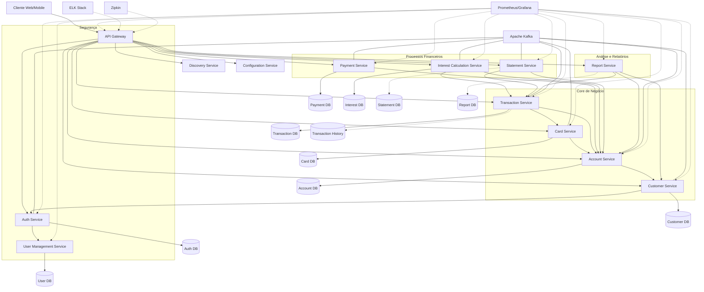

# Plano de Modernização Completa: AWS CardDemo para Java Microservices

## Sumário Executivo

Este documento apresenta o plano abrangente para modernizar a aplicação AWS CardDemo, migrando-a de um sistema mainframe Cobol/CICS/VSAM para uma arquitetura moderna baseada em Java Spring Boot e microserviços. O plano cobre todos os aspectos do processo de modernização, desde a arquitetura proposta até estimativas de esforço, requisitos funcionais e não funcionais, estratégias de teste e gestão ágil do projeto.

## 1. Arquitetura Proposta (Detalhada)

### 1.1. Visão Geral da Arquitetura

A nova arquitetura do CardDemo será baseada em microserviços, seguindo princípios de design como alta coesão, baixo acoplamento, isolamento de falhas e escalabilidade independente. A aplicação será decomposta em serviços autônomos, cada um responsável por um domínio específico do negócio.

### 1.2. Microserviços a Serem Criados

#### 1.2.1. Auth Service (Serviço de Autenticação)
- **Responsabilidades**: Autenticação de usuários, gestão de tokens JWT, autorização baseada em papéis
- **Principais Entidades**: User, Role, Permission
- **APIs**: Login, logout, refresh token, verificação de permissões
- **Equivalência Cobol**: COSGN00C (login), componentes de segurança em diversos programas

#### 1.2.2. User Management Service (Serviço de Gestão de Usuários)
- **Responsabilidades**: CRUD de usuários, gestão de perfis
- **Principais Entidades**: User, UserProfile
- **APIs**: Criar, atualizar, recuperar e excluir usuários e perfis
- **Equivalência Cobol**: COUSR00C, COUSR01C, COUSR02C, COUSR03C

#### 1.2.3. Customer Service (Serviço de Clientes)
- **Responsabilidades**: Gestão de dados de clientes
- **Principais Entidades**: Customer, Address, Contact
- **APIs**: CRUD de clientes e informações relacionadas
- **Equivalência Cobol**: Componentes relacionados a clientes em vários programas

#### 1.2.4. Account Service (Serviço de Contas)
- **Responsabilidades**: Gestão de contas de cartão de crédito, saldos, limites
- **Principais Entidades**: Account, Balance, Limit
- **APIs**: Criar, atualizar, consultar contas, ajustar limites, calcular saldos
- **Equivalência Cobol**: COACTVWC, COACTUPC, CBACT01C, CBACT02C, CBACT03C

#### 1.2.5. Card Service (Serviço de Cartões)
- **Responsabilidades**: Gestão de cartões de crédito, associação com contas
- **Principais Entidades**: Card, CardStatus, CardType
- **APIs**: Emitir, ativar, bloquear cartões, associar a contas
- **Equivalência Cobol**: COCRDLIC, COCRDSLC, COCRDUPC

#### 1.2.6. Transaction Service (Serviço de Transações)
- **Responsabilidades**: Processamento e consulta de transações
- **Principais Entidades**: Transaction, TransactionType, TransactionCategory
- **APIs**: Registrar, consultar, listar transações
- **Equivalência Cobol**: COTRN00C, COTRN01C, COTRN02C, CBTRN02C

#### 1.2.7. Payment Service (Serviço de Pagamentos)
- **Responsabilidades**: Processamento de pagamentos de faturas
- **Principais Entidades**: Payment, PaymentMethod, PaymentStatus
- **APIs**: Registrar pagamentos, consultar histórico, processar pagamentos
- **Equivalência Cobol**: COBIL00C, componentes de pagamento em outros programas

#### 1.2.8. Statement Service (Serviço de Extratos)
- **Responsabilidades**: Geração e consulta de extratos
- **Principais Entidades**: Statement, StatementEntry
- **APIs**: Gerar, recuperar, listar extratos
- **Equivalência Cobol**: CBSTM03A, CBSTM03B

#### 1.2.9. Interest Calculation Service (Serviço de Cálculo de Juros)
- **Responsabilidades**: Cálculo de juros sobre saldos
- **Principais Entidades**: InterestRule, InterestCalculation
- **APIs**: Calcular juros, consultar regras de juros
- **Equivalência Cobol**: CBACT04C

#### 1.2.10. Report Service (Serviço de Relatórios)
- **Responsabilidades**: Geração de relatórios e análises
- **Principais Entidades**: Report, ReportTemplate, ReportData
- **APIs**: Gerar, recuperar, listar relatórios
- **Equivalência Cobol**: CORPT00C, componentes de relatório em outros programas

#### 1.2.11. API Gateway
- **Responsabilidades**: Roteamento de requisições, autenticação, load balancing
- **Principais Funcionalidades**: Roteamento, rate limiting, logging, segurança
- **Tecnologia**: Spring Cloud Gateway

#### 1.2.12. Discovery Service
- **Responsabilidades**: Registro e descoberta de serviços
- **Principais Funcionalidades**: Registro, health check, load balancing
- **Tecnologia**: Spring Cloud Netflix Eureka

#### 1.2.13. Configuration Service
- **Responsabilidades**: Configuração centralizada
- **Principais Funcionalidades**: Configurações por ambiente, refresh em tempo real
- **Tecnologia**: Spring Cloud Config

### 1.3. Tecnologias Específicas do Ecossistema Java/Spring Boot

#### 1.3.1. Frameworks e Bibliotecas Core
- **Spring Boot**: Base para todos os microserviços (versão 3.x)
- **Spring Cloud**: Para padrões de microserviços
- **Spring Data JPA**: Para persistência e acesso a dados
- **Spring Security**: Para autenticação e autorização
- **Spring WebFlux**: Para serviços que se beneficiam de programação reativa

#### 1.3.2. Ferramentas e Componentes Específicos
- **Spring Actuator**: Para monitoramento e health checks
- **Spring Cloud Stream**: Para comunicação baseada em eventos
- **Resilience4j**: Para circuit breaking e resiliência
- **Micrometer**: Para métricas e telemetria
- **Sleuth/Zipkin**: Para rastreamento distribuído
- **Lombok**: Para redução de boilerplate code
- **MapStruct**: Para mapeamento entre DTOs e entidades
- **Swagger/OpenAPI**: Para documentação de API

#### 1.3.3. Bancos de Dados e Persistência
- **PostgreSQL**: Banco de dados relacional primário
- **Redis**: Para cache e dados voláteis
- **MongoDB**: Para dados não estruturados (relatórios, logs)
- **Liquibase/Flyway**: Para migração e versionamento de schema

#### 1.3.4. Mensageria e Eventos
- **Kafka**: Para comunicação assíncrona entre serviços
- **RabbitMQ**: Para filas e processamento assíncrono

#### 1.3.5. Monitoramento e Observabilidade
- **ELK Stack**: Para logging centralizado
- **Prometheus/Grafana**: Para métricas e dashboards
- **Spring Cloud Sleuth/Zipkin**: Para tracing distribuído

### 1.4. Estratégias de Comunicação entre Microserviços

#### 1.4.1. Comunicação Síncrona
- **REST**: Para comunicação direta entre serviços
  - Endpoints padronizados RESTful
  - Versionamento de API (URI ou cabeçalhos)
  - HTTP status codes para indicação de resultados
  - Documentação OpenAPI para todas as APIs

- **GraphQL (opcional)**: Para queries complexas e flexíveis
  - Implementado em serviços de consulta com necessidades avançadas
  - Redução de múltiplas chamadas para composição de dados

#### 1.4.2. Comunicação Assíncrona
- **Event-Driven Architecture**: Utilizando Kafka
  - Publicação de eventos de domínio
  - Padrão de choreography para fluxos de negócio distribuídos
  - Garantia de entrega e processamento eventual

- **Command Pattern**: Para operações que requerem coordenação
  - Filas dedicadas para comandos específicos
  - Rastreabilidade de comandos e resultados

#### 1.4.3. Patterns de Comunicação
- **API Composition**: Para agregação de dados de múltiplos serviços
- **CQRS**: Separação de responsabilidades de leitura e escrita
- **Saga Pattern**: Para transações distribuídas
- **Event Sourcing (seletivo)**: Para domínios com necessidade de auditoria completa

### 1.5. Considerações sobre Persistência de Dados

#### 1.5.1. Estratégia de Banco de Dados
- **Database per Service**: Cada microserviço tem seu próprio banco de dados
- **Shared Database for Specific Services**: Em casos específicos onde a separação completa não é viável

#### 1.5.2. Persistência por Microserviço

| Microserviço | Tipo de Banco | Justificativa |
|--------------|---------------|---------------|
| Auth Service | PostgreSQL | Necessidade de transações ACID para dados críticos de segurança |
| User Management | PostgreSQL | Estrutura relacional bem definida para usuários e perfis |
| Customer Service | PostgreSQL | Dados estruturados de clientes com relações |
| Account Service | PostgreSQL | Dados financeiros críticos com necessidade de transações |
| Card Service | PostgreSQL | Dados estruturados com relações a contas e clientes |
| Transaction Service | PostgreSQL + MongoDB | Relacional para transações ativas, NoSQL para histórico |
| Payment Service | PostgreSQL | Dados financeiros com necessidade de integridade |
| Statement Service | MongoDB | Armazenamento de extratos gerados e históricos |
| Interest Calculation | PostgreSQL | Dados de cálculos e regras de negócio estruturados |
| Report Service | MongoDB | Armazenamento de relatórios e dados agregados |

#### 1.5.3. Estratégia de Migração de Dados
- Migração de dados VSAM para esquemas relacionais
- Transformação e normalização de dados
- Validação e reconciliação pós-migração
- Retenção de dados históricos em armazenamento de longo prazo

## 2. Diagrama da Arquitetura Proposta

### 2.1. Diagrama de Componentes (Microserviços)

## 3. Fases de Modernização

A modernização do sistema CardDemo será realizada em fases incrementais, seguindo uma abordagem de "strangler pattern" para substituir gradualmente o sistema legado. Cada fase entregará valor de negócio incremental e minimizará riscos.

### 3.1. Divisão do Projeto em Fases

#### Fase 1: Fundação e Infraestrutura
- Estabelecimento da arquitetura base
- Configuração de CI/CD
- Configuração de ambientes (desenvolvimento, teste, produção)
- Implementação dos serviços de infraestrutura (API Gateway, Discovery, Config)
- Implementação do serviço de autenticação

#### Fase 2: Core Business Domain - Gestão de Clientes e Contas
- Implementação do Customer Service
- Implementação do Account Service
- Implementação do User Management Service
- Migração inicial de dados de clientes e contas
- Desenvolvimento de APIs e interfaces básicas

#### Fase 3: Domínio de Cartões e Transações
- Implementação do Card Service
- Implementação do Transaction Service
- Integração com serviços existentes
- Migração de dados de cartões e histórico de transações
- Desenvolvimento de interfaces para gestão de cartões e transações

#### Fase 4: Processamento Financeiro
- Implementação do Payment Service
- Implementação do Interest Calculation Service
- Integração com serviços de transação e conta
- Migração das regras de cálculo de juros e processamento de pagamentos
- Validação e testes de integridade financeira

#### Fase 5: Relatórios e Extratos
- Implementação do Statement Service
- Implementação do Report Service
- Migração de templates e dados históricos
- Desenvolvimento de interfaces de relatórios e consultas

#### Fase 6: Integração e Testes End-to-End
- Integração completa entre todos os serviços
- Testes de performance e carga
- Validação de fluxos de negócio completos
- Refinamento de interfaces de usuário

#### Fase 7: Operação Paralela e Cutover
- Operação do novo sistema em paralelo com o legado
- Validação cruzada de resultados
- Migração final de dados
- Cutover para o novo sistema
- Descomissionamento do sistema legado

### 3.2. Ordem Sugerida para Desenvolvimento e Entrega

A ordem de desenvolvimento será baseada em prioridade de negócio e dependências técnicas:

1. **Serviços de Infraestrutura e Segurança**
   - API Gateway, Discovery Service, Config Service
   - Auth Service, User Management Service

2. **Serviços de Domínio Core**
   - Customer Service
   - Account Service
   - Card Service

3. **Serviços de Transações e Processamento**
   - Transaction Service
   - Payment Service

4. **Serviços de Cálculos e Processamento Financeiro**
   - Interest Calculation Service

5. **Serviços de Relatórios e Extratos**
   - Statement Service
   - Report Service

Esta ordem permite construir uma base sólida antes de implementar funcionalidades mais complexas e garante que dependências entre serviços sejam respeitadas.

## 4. Estimativas de Tempo de Desenvolvimento

A seguir, apresentamos estimativas de esforço para cada módulo/microserviço. As estimativas são apresentadas em semanas de desenvolvimento, considerando uma equipe de desenvolvimento completa com frontend, backend, QA e DevOps.

### 4.1. Estimativas por Microserviço

| Microserviço/Componente | Complexidade | Estimativa (semanas) | Justificativa |
|-------------------------|--------------|----------------------|---------------|
| API Gateway | Média | 2 | Configuração, roteamento, segurança básica |
| Discovery Service | Baixa | 1 | Configuração e integração |
| Config Service | Baixa | 1 | Configuração e setup |
| Auth Service | Alta | 4 | Segurança crítica, integração com sistemas existentes |
| User Management Service | Média | 3 | CRUD de usuários, perfis de acesso |
| Customer Service | Alta | 4 | Dados complexos de cliente, validações |
| Account Service | Alta | 5 | Lógica financeira complexa, validações rigorosas |
| Card Service | Média | 3 | Gestão de cartões, integrações |
| Transaction Service | Muito Alta | 6 | Volume de dados, complexidade de processamento |
| Payment Service | Alta | 4 | Lógica financeira, consistência de dados |
| Interest Calculation Service | Muito Alta | 6 | Regras complexas de negócio, precisão financeira |
| Statement Service | Alta | 4 | Geração de documentos, histórico |
| Report Service | Alta | 5 | Consultas complexas, dashboards |
| UI/Frontend | Muito Alta | 8 | Múltiplas interfaces, fluxos de usuário |
| Migração de Dados | Alta | 5 | Transformação, validação, reconciliação |
| Testes de Integração | Alta | 4 | Cobertura completa dos fluxos de negócio |
| DevOps/CI/CD | Média | 3 | Pipelines, automação, monitoramento |

### 4.2. Estimativa Total e Timeline

- **Duração Total Estimada**: 68 semanas (considerando desenvolvimento sequencial)
- **Duração Realista com Paralelização**: 38-42 semanas

A duração pode ser reduzida com:
- Desenvolvimento paralelo de serviços independentes
- Alocação de múltiplas equipes
- Priorização de funcionalidades para MVP
- Uso de ferramentas de aceleração e frameworks

### 4.3. Milestones Principais

1. **Milestone 1** (Semana 8): Infraestrutura básica e serviços de autenticação
2. **Milestone 2** (Semana 18): Core de negócio (clientes, contas, cartões)
3. **Milestone 3** (Semana 28): Transações e pagamentos
4. **Milestone 4** (Semana 34): Cálculo de juros e processamento financeiro
5. **Milestone 5** (Semana 38): Relatórios e extratos
6. **Milestone 6** (Semana 42): Sistema completo integrado e testado

## 5. Detalhes Técnicos da Migração

### 5.1. Estratégia de Migração de Dados

#### 5.1.1. Abordagem de Migração

A migração de dados do sistema legado Cobol/VSAM para o novo sistema Java/PostgreSQL/MongoDB seguirá uma estratégia em fases:

1. **Análise e Mapeamento**
   - Mapeamento detalhado das estruturas de dados VSAM para esquemas relacionais
   - Identificação de relacionamentos implícitos e explícitos
   - Definição de regras de transformação e limpeza

2. **Extração Inicial**
   - Extração de dados dos arquivos VSAM para formato intermediário (CSV/JSON)
   - Validação de integridade dos dados extraídos
   - Verificação de totais de controle e reconciliação

3. **Transformação e Normalização**
   - Aplicação de regras de transformação
   - Normalização de dados para o modelo relacional
   - Enriquecimento com metadados adicionais
   - Geração de identificadores únicos consistentes

4. **Carregamento**
   - Carregamento em bancos de dados de staging
   - Validação de integridade referencial
   - Testes de consulta e acesso

5. **Validação e Reconciliação**
   - Execução de processos paralelos nos sistemas antigo e novo
   - Comparação de resultados
   - Correção de discrepâncias

6. **Migração Final**
   - Congelamento do sistema legado
   - Migração final de dados delta
   - Ativação do novo sistema

#### 5.1.2. Ferramentas e Tecnologias

- **ETL**: Apache NiFi ou Talend para processos de extração e transformação
- **Validação**: Ferramentas customizadas para reconciliação
- **Migração Contínua**: Change Data Capture (CDC) para sincronização contínua durante a transição

#### 5.1.3. Estratégia por Tipo de Dado

| Tipo de Dado | Estratégia de Migração | Desafios |
|--------------|------------------------|----------|
| Dados Mestres (Clientes, Contas) | Migração completa inicial + CDC | Integridade referencial, qualidade de dados |
| Transações | Migração histórica + cutover para novas | Volume, preservação de histórico |
| Configurações | Migração manual com validação | Mapeamento para novos conceitos |
| Históricos | Migração por lotes, potencial arquivamento | Volume, necessidade de acesso |

### 5.2. Abordagem para Refatorar/Recriar a Lógica de Negócio

#### 5.2.1. Metodologia de Migração de Código

A migração da lógica de negócio Cobol para Java seguirá uma abordagem de reescrita funcional:

1. **Análise de Código**
   - Extração de regras de negócio do código Cobol
   - Documentação de fluxos e algoritmos
   - Identificação de edge cases e tratamentos especiais

2. **Modelagem em Domain-Driven Design**
   - Definição de agregados, entidades e objetos de valor
   - Modelagem de serviços de domínio
   - Definição de limites de contexto

3. **Implementação Java**
   - Desenvolvimento de modelos de domínio em Java
   - Implementação de regras de negócio como serviços
   - Adoção de padrões como Factory, Repository, Service

4. **Testes Paralelos**
   - Execução da mesma lógica nos sistemas antigo e novo
   - Comparação de resultados
   - Ajustes para garantir comportamento idêntico

#### 5.2.2. Tratamento de Casos Específicos

| Componente Cobol | Abordagem de Migração | Tecnologia Java |
|------------------|------------------------|-----------------|
| Cálculos Financeiros (CBACT04C) | Implementação com bibliotecas financeiras | Java Money, BigDecimal |
| Processamento de Transações (CBTRN02C) | Serviços de domínio + eventos | Spring Service, Kafka |
| Validações de Dados | Bean Validation + regras customizadas | Hibernate Validator, Custom Validators |
| Fluxos de UI (CICS) | Implementação como APIs REST + UI React | Spring MVC/WebFlux, React |
| Batch Processing | Jobs Spring Batch | Spring Batch, Schedulers |

#### 5.2.3. Preservação de Lógica Crítica

Para componentes com lógica de negócio particularmente complexa ou crítica:

1. **Documentação Detalhada**: Documentação passo a passo da lógica original
2. **Testes Rigorosos**: Cobertura completa com testes unitários e de integração
3. **Revisão por Especialistas**: Validação por especialistas do domínio
4. **Execução Paralela**: Validação cruzada de resultados durante período de transição

### 5.3. Tratamento de Dependências e Integrações

#### 5.3.1. Integrações Internas

As integrações entre os novos microserviços serão implementadas através de:

1. **REST APIs**: Para comunicação síncrona direta
2. **Mensageria**: Kafka para comunicação assíncrona baseada em eventos
3. **Service Discovery**: Eureka para localização dinâmica de serviços
4. **API Gateway**: Para roteamento e política de acesso unificados

#### 5.3.2. Integrações Externas

Para integrações com sistemas externos:

1. **Adaptadores**: Implementação de adaptadores para sistemas legados
2. **APIs**: Exposição de APIs bem definidas para consumidores externos
3. **Gateways de Integração**: Para tradução de protocolos e formatos

#### 5.3.3. Estratégia de Coexistência

Durante o período de transição, será necessária a coexistência dos sistemas antigo e novo:

1. **Strangler Pattern**: Substituição gradual de componentes
2. **Camadas de Adaptação**: Adaptadores bidirecionais para comunicação entre sistemas
3. **Sincronização de Dados**: CDC ou processos batch para manter dados sincronizados
4. **Chaveamento de Tráfego**: Capacidade de direcionar tráfego para sistema antigo ou novo

## 6. Requisitos Funcionais (Mapeados e Novos)

### 6.1. Requisitos Mapeados do Sistema Legado

#### 6.1.1. Autenticação e Segurança
- RF01: O sistema deve permitir autenticação de usuários com ID e senha
- RF02: O sistema deve suportar diferentes perfis de usuário (admin, regular)
- RF03: O sistema deve controlar acesso às funcionalidades baseado no perfil do usuário

#### 6.1.2. Gestão de Usuários
- RF04: Administradores devem poder listar todos os usuários do sistema
- RF05: Administradores devem poder adicionar novos usuários
- RF06: Administradores devem poder atualizar dados de usuários existentes
- RF07: Administradores devem poder excluir usuários

#### 6.1.3. Gestão de Clientes
- RF08: O sistema deve permitir cadastro de clientes com dados pessoais e endereço
- RF09: O sistema deve permitir consulta e atualização de dados de clientes
- RF10: O sistema deve associar clientes a contas e cartões

#### 6.1.4. Gestão de Contas
- RF11: O sistema deve permitir visualizar detalhes de contas
- RF12: O sistema deve permitir atualizar informações de contas
- RF13: O sistema deve controlar limites de crédito por conta
- RF14: O sistema deve manter histórico de saldos e movimentações

#### 6.1.5. Gestão de Cartões
- RF15: O sistema deve permitir listar cartões associados a uma conta
- RF16: O sistema deve permitir visualizar detalhes de cartões
- RF17: O sistema deve permitir atualizar informações de cartões
- RF18: O sistema deve controlar status de cartões (ativo, bloqueado, etc.)

#### 6.1.6. Gestão de Transações
- RF19: O sistema deve permitir listar transações de uma conta/cartão
- RF20: O sistema deve permitir visualizar detalhes de transações
- RF21: O sistema deve permitir registrar novas transações
- RF22: O sistema deve processar transações em lote (batch)

#### 6.1.7. Processamento Financeiro
- RF23: O sistema deve calcular juros sobre saldos devedores
- RF24: O sistema deve permitir registrar pagamentos de faturas
- RF25: O sistema deve atualizar saldos após transações e pagamentos
- RF26: O sistema deve gerar extratos mensais de transações

#### 6.1.8. Relatórios
- RF27: O sistema deve gerar relatórios de transações por período
- RF28: O sistema deve permitir consultas analíticas sobre transações
- RF29: O sistema deve gerar extratos para clientes

### 6.2. Novos Requisitos Funcionais

#### 6.2.1. Segurança Aprimorada
- RF30: O sistema deve implementar autenticação multifator
- RF31: O sistema deve suportar controle de acesso baseado em funções (RBAC) granular
- RF32: O sistema deve manter log de auditoria de todas ações sensíveis

#### 6.2.2. Experiência do Usuário
- RF33: O sistema deve fornecer interface web responsiva
- RF34: O sistema deve suportar notificações em tempo real
- RF35: O sistema deve permitir personalização da interface pelo usuário

#### 6.2.3. Operações Estendidas
- RF36: O sistema deve suportar diferentes moedas e conversão automática
- RF37: O sistema deve implementar mecanismos de detecção de fraude
- RF38: O sistema deve fornecer APIs para integração com sistemas externos
- RF39: O sistema deve suportar múltiplos métodos de pagamento
- RF40: O sistema deve permitir configuração de regras de limite de crédito dinâmicas

#### 6.2.4. Analytics e Inteligência
- RF41: O sistema deve fornecer dashboards analíticos em tempo real
- RF42: O sistema deve implementar alertas baseados em regras configuráveis
- RF43: O sistema deve fornecer análise preditiva de comportamento de gastos
- RF44: O sistema deve suportar segmentação de clientes baseada em padrões de uso

#### 6.2.5. Mobile e Omnichannel
- RF45: O sistema deve fornecer APIs para aplicativos móveis
- RF46: O sistema deve suportar notificações push para eventos importantes
- RF47: O sistema deve permitir operações consistentes entre canais diferentes

## 7. Requisitos Não Funcionais

### 7.1. Performance
- RNF01: As APIs REST devem responder em menos de 300ms para 95% das requisições
- RNF02: O sistema deve suportar processamento de pelo menos 1000 transações por segundo
- RNF03: Batch de cálculo de juros deve processar 1 milhão de contas em menos de 2 horas
- RNF04: Geração de extratos deve processar 100 mil clientes em menos de 3 horas
- RNF05: Consultas analíticas complexas devem retornar em menos de 3 segundos

### 7.2. Escalabilidade
- RNF06: A arquitetura deve permitir escalabilidade horizontal de todos os serviços
- RNF07: O sistema deve escalar automaticamente baseado em métricas de carga
- RNF08: O sistema deve suportar aumento de 10x na base de clientes sem redesenho
- RNF09: Cada microserviço deve ser escalável independentemente
- RNF10: O banco de dados deve suportar sharding para crescimento da base de dados

### 7.3. Segurança
- RNF11: Todos os dados sensíveis devem ser criptografados em repouso e em trânsito
- RNF12: O sistema deve implementar proteção contra ataques comuns (OWASP Top 10)
- RNF13: Senhas devem ser armazenadas com algoritmos seguros de hash e salt
- RNF14: Tokens de acesso devem expirar em tempo configurável (default 15 minutos)
- RNF15: Registros de auditoria devem ser imutáveis e preservados por período definido
- RNF16: O sistema deve implementar rate limiting para prevenir ataques de DoS

### 7.4. Manutenibilidade
- RNF17: O código deve seguir convenções e padrões documentados
- RNF18: Cobertura de testes unitários deve ser de pelo menos 80%
- RNF19: Todos os serviços devem ter documentação de API OpenAPI/Swagger
- RNF20: Atualizações de software devem ser possíveis sem downtime (rolling updates)
- RNF21: O sistema deve suportar versionamento de API para compatibilidade

### 7.5. Disponibilidade
- RNF22: O sistema deve ter disponibilidade de 99.95% (downtime máximo de ~4.38 horas/ano)
- RNF23: Falhas em um serviço não devem afetar a disponibilidade de outros (isolamento de falhas)
- RNF24: O sistema deve implementar circuit breakers para evitar falhas em cascata
- RNF25: Atualizações de software não devem causar indisponibilidade
- RNF26: O sistema deve ter capacidade de failover automático em caso de falha de infraestrutura

### 7.6. Compatibilidade
- RNF27: As APIs devem ser compatíveis com navegadores modernos (Chrome, Firefox, Safari, Edge)
- RNF28: A interface de usuário deve funcionar em dispositivos desktop, tablet e mobile
- RNF29: As APIs devem suportar integração com sistemas legados via adaptadores

### 7.7. Recuperabilidade
- RNF30: O sistema deve ter backup automatizado com RPO (Recovery Point Objective) < 15 minutos
- RNF31: O RTO (Recovery Time Objective) deve ser < 1 hora para falhas não catastróficas
- RNF32: Os logs de transação devem permitir point-in-time recovery
- RNF33: O sistema deve ter capacidade de rollback de atualizações em caso de problemas

### 7.8. Observabilidade
- RNF34: Todos os serviços devem expor métricas para monitoramento
- RNF35: O sistema deve implementar logging centralizado com níveis configuráveis
- RNF36: O sistema deve suportar trace distribuído para acompanhamento de transações
- RNF37: Dashboards de monitoramento devem fornecer visibilidade de saúde e performance
- RNF38: Alertas automáticos devem ser configurados para condições anômalas

## 8. Casos de Testes (Estratégia)

### 8.1. Abordagem de Testes

A estratégia de testes para o projeto CardDemo modernizado adotará uma abordagem abrangente, cobrindo todos os níveis da pirâmide de testes:

#### 8.1.1. Testes Unitários
- **Escopo**: Componentes individuais, métodos, classes
- **Ferramentas**: JUnit 5, Mockito, AssertJ
- **Responsáveis**: Desenvolvedores
- **Automação**: Execução em cada commit, parte do pipeline CI/CD
- **Cobertura esperada**: Mínimo de 80% de cobertura de código

#### 8.1.2. Testes de Integração
- **Escopo**: Interações entre componentes, integrações com bancos de dados, mensageria
- **Ferramentas**: Spring Boot Test, Testcontainers, WireMock
- **Responsáveis**: Desenvolvedores
- **Automação**: Execução diária e em PRs
- **Abordagem**: Testes focados em contratos e comportamentos

#### 8.1.3. Testes de Contrato
- **Escopo**: Contratos entre serviços, APIs
- **Ferramentas**: Spring Cloud Contract, Pact
- **Responsáveis**: Desenvolvedores de serviços produtores e consumidores
- **Automação**: Geração e verificação de contratos como parte do CI/CD
- **Abordagem**: Consumer-driven contract testing

#### 8.1.4. Testes End-to-End
- **Escopo**: Fluxos completos de negócio, navegação UI
- **Ferramentas**: Selenium, Cypress, Cucumber
- **Responsáveis**: QA, Analistas de Negócio
- **Automação**: Execução programada e antes de releases
- **Abordagem**: BDD com cenários de negócio

#### 8.1.5. Testes de Performance
- **Escopo**: Latência, throughput, escalabilidade
- **Ferramentas**: JMeter, Gatling, K6
- **Responsáveis**: Engenheiros de Performance, DevOps
- **Automação**: Execução periódica e antes de releases importantes
- **Métricas**: Tempos de resposta, throughput, utilização de recursos

#### 8.1.6. Testes de Segurança
- **Escopo**: Vulnerabilidades, conformidade com padrões
- **Ferramentas**: OWASP ZAP, SonarQube, ferramentas SAST/DAST
- **Responsáveis**: Especialistas em Segurança
- **Automação**: Scan automático como parte do pipeline
- **Abordagem**: Identificação proativa de vulnerabilidades

### 8.2. Ciclo de Vida de Testes

O ciclo de vida de testes será integrado ao processo de desenvolvimento:

1. **Planejamento**: Definição de escopo, casos e critérios de aceitação
2. **Preparação**: Criação de scripts, dados de teste e ambientes
3. **Execução**: Automatizada e manual conforme necessário
4. **Avaliação**: Análise de resultados, identificação de problemas
5. **Reporte**: Documentação de resultados e defeitos
6. **Reteste**: Verificação de correções
7. **Melhoria Contínua**: Refinamento de testes baseado em aprendizados

### 8.3. Ambientes de Teste

O projeto terá os seguintes ambientes:

1. **Desenvolvimento**: Para testes unitários e de integração iniciais
2. **Teste Integrado**: Para testes de integração entre serviços
3. **QA**: Para testes funcionais completos e validação de negócio
4. **Pré-Produção**: Ambiente espelho da produção para testes finais
5. **Produção**: Ambiente final com monitoramento intensivo inicial

### 8.4. Casos de Teste Prioritários

Alguns fluxos críticos que serão priorizados nos testes:

1. **Autenticação e Autorização**
   - Login com credenciais válidas e inválidas
   - Acesso a recursos com diferentes perfis
   - Expiração e renovação de tokens

2. **Processamento Financeiro**
   - Registro de transações e impacto em saldos
   - Cálculo de juros em diferentes cenários
   - Processamento de pagamentos e ajustes de saldo

3. **Integridade de Dados**
   - Verificação de consistência entre serviços
   - Validação de regras de negócio em atualizações
   - Testes de concorrência e condições de corrida

4. **Relatórios e Extratos**
   - Geração de extratos com diferentes volumes de dados
   - Reconciliação de valores em relatórios
   - Performance de consultas analíticas complexas

5. **Migração de Dados**
   - Validação de dados migrados do sistema legado
   - Comparação de resultados entre sistemas
   - Verificação de integridade referencial após migração

## 9. Gestão de Projeto Ágil

### 9.1. Épicos

#### EP01: Infraestrutura e Fundação
- Estabelecimento da arquitetura base de microserviços
- Configuração de ambientes e pipelines de CI/CD
- Implementação de serviços de infraestrutura (Gateway, Discovery, Config)

#### EP02: Segurança e Autenticação
- Implementação do sistema de autenticação e autorização
- Gestão de usuários e perfis
- Auditoria e logging de segurança

#### EP03: Gestão de Clientes
- Cadastro e manutenção de clientes
- Consultas e relatórios de clientes
- Associações com contas e cartões

#### EP04: Gestão de Contas
- Criação e manutenção de contas
- Gestão de limites e status
- Consultas e relatórios de contas

#### EP05: Gestão de Cartões
- Emissão e manutenção de cartões
- Associação com contas e clientes
- Gestão de status e limites de cartões

#### EP06: Processamento de Transações
- Registro e processamento de transações
- Consulta e análise de transações
- Processamento batch de transações

#### EP07: Gestão Financeira
- Cálculo de juros e taxas
- Processamento de pagamentos
- Conciliação e ajustes

#### EP08: Relatórios e Extratos
- Geração de extratos para clientes
- Relatórios gerenciais e analíticos
- Dashboards e visualização de dados

#### EP09: Integração e Operações
- Migração de dados do sistema legado
- Integração com sistemas externos
- Operação em paralelo e cutover

#### EP10: Frontend e Experiência do Usuário
- Desenvolvimento de interfaces web responsivas
- Implementação de dashboards e visualizações
- Experiência mobile e multicanal

### 9.2. Estórias de Usuário

As estórias de usuário serão derivadas dos épicos. Exemplos de estórias para alguns épicos:

#### EP02: Segurança e Autenticação

- **US01**: Como usuário, quero me autenticar no sistema usando meu ID e senha para acessar as funcionalidades
- **US02**: Como administrador, quero criar novos usuários com perfis específicos para controlar o acesso
- **US03**: Como usuário, quero recuperar minha senha através de um processo seguro quando eu a esquecer
- **US04**: Como administrador, quero visualizar os logs de atividades dos usuários para fins de auditoria
- **US05**: Como usuário, quero alterar minha própria senha periodicamente para manter a segurança
- **US06**: Como administrador, quero definir políticas de complexidade de senha para aumentar a segurança

#### EP04: Gestão de Contas

- **US07**: Como operador, quero visualizar os detalhes de uma conta para atender solicitações de clientes
- **US08**: Como operador, quero atualizar os limites de crédito de uma conta após análise de crédito
- **US09**: Como operador, quero bloquear temporariamente uma conta em caso de suspeita de fraude
- **US10**: Como gerente, quero visualizar relatórios de contas por status para acompanhamento
- **US11**: Como operador, quero pesquisar contas por diversos critérios para localização rápida
- **US12**: Como analista, quero exportar dados de contas para análise externa

#### EP06: Processamento de Transações

- **US13**: Como cliente, quero visualizar minhas transações recentes para controle financeiro
- **US14**: Como operador, quero registrar uma nova transação manualmente quando necessário
- **US15**: Como operador, quero estornar uma transação incorreta para corrigir erros
- **US16**: Como sistema, quero processar transações em lote durante a noite para atualizar saldos
- **US17**: Como analista, quero consultar transações por período e categoria para análise
- **US18**: Como sistema, quero validar cada transação contra regras de fraude antes de processá-la

### 9.3. Estórias Técnicas

As estórias técnicas abordarão necessidades de infraestrutura, arquitetura e DevOps:

- **TS01**: Como desenvolvedor, quero configurar o API Gateway para rotear requisições aos microserviços
- **TS02**: Como desenvolvedor, quero implementar o serviço de descoberta para registro dinâmico de serviços
- **TS03**: Como DevOps, quero configurar pipelines de CI/CD para automação de build e deploy
- **TS04**: Como arquiteto, quero implementar circuit breakers para isolamento de falhas
- **TS05**: Como desenvolvedor, quero configurar monitoramento e métricas para todos os serviços
- **TS06**: Como DBA, quero implementar estratégia de migração de dados VSAM para PostgreSQL
- **TS07**: Como desenvolvedor, quero criar ambiente de testes com dados simulados para desenvolvimento
- **TS08**: Como DevOps, quero configurar backups automatizados para os bancos de dados
- **TS09**: Como arquiteto, quero implementar caching distribuído para otimizar performance
- **TS10**: Como desenvolvedor, quero configurar logging centralizado para todos os serviços

## 10. Outras Informações Pertinentes

### 10.1. Riscos do Projeto

| ID | Risco | Probabilidade | Impacto | Mitigação |
|----|------|--------------|---------|-----------|
| R01 | Complexidade subestimada da lógica de negócio legada | Média | Alto | Análise detalhada do código fonte, validação com especialistas de domínio |
| R02 | Inconsistências nos dados durante migração | Alta | Alto | Ferramentas de validação, reconciliação, operação paralela |
| R03 | Performance inadequada da nova arquitetura | Média | Alto | Testes de performance desde cedo, monitoramento, otimização proativa |
| R04 | Resistência dos usuários à mudança | Alta | Médio | Treinamento, comunicação clara, envolvimento dos stakeholders |
| R05 | Problemas de integração com sistemas externos | Média | Médio | Identificação antecipada de dependências, implementação de adaptadores |
| R06 | Atraso na entrega de componentes críticos | Média | Alto | Priorização baseada em dependências, paralelização de trabalho |
| R07 | Falhas em requisitos de segurança | Baixa | Muito Alto | Revisões de segurança, testes de penetração, compliance reviews |
| R08 | Indisponibilidade durante cutover | Média | Alto | Plano detalhado de cutover, testes, rollback strategy |
| R09 | Custos de infraestrutura maiores que o previsto | Média | Médio | Monitoramento de custos, otimização de recursos, escalabilidade inteligente |
| R10 | Escassez de desenvolvedores com skills necessárias | Alta | Médio | Treinamento antecipado, documentação detalhada, consultores especialistas |

### 10.2. Premissas

- A documentação e código fonte do sistema legado estão disponíveis e acessíveis
- Os especialistas de domínio do sistema atual estarão disponíveis para consulta
- Haverá disponibilidade de ambiente para operação paralela dos sistemas
- A organização está comprometida com a migração completa do sistema
- Existe uma estratégia de gerenciamento de mudança para usuários finais

### 10.3. Equipe Sugerida

| Papel | Quantidade | Responsabilidades |
|-------|------------|-------------------|
| Gerente de Projeto | 1 | Coordenação geral, gestão de riscos, comunicação |
| Arquiteto de Solução | 2 | Desenho de arquitetura, decisões técnicas |
| Product Owner | 1 | Priorização, requisitos, aceitação |
| Scrum Master | 2 | Facilitação de processos ágeis |
| Desenvolvedor Backend | 8-10 | Implementação de microserviços Java |
| Desenvolvedor Frontend | 4-6 | Implementação de interfaces React |
| Especialista em Mainframe/Cobol | 2 | Análise do sistema legado, suporte à migração |
| Especialista em QA | 3-4 | Estratégia de testes, automação, validação |
| DevOps Engineer | 2-3 | CI/CD, infraestrutura, monitoramento |
| DBA | 2 | Design de banco de dados, migração, performance |
| Especialista em Segurança | 1 | Revisões de segurança, compliance |
| UX Designer | 1-2 | Design de interfaces, experiência do usuário |

### 10.4. Ferramentas de Desenvolvimento

| Categoria | Ferramentas |
|-----------|-------------|
| IDEs | IntelliJ IDEA, VS Code |
| Controle de Versão | Git, GitHub/GitLab/Bitbucket |
| CI/CD | Jenkins, GitHub Actions, GitLab CI/CD |
| Containerização | Docker, Kubernetes |
| Gerenciamento de Dependências | Maven, Gradle |
| Qualidade de Código | SonarQube, Checkstyle, PMD |
| Testes | JUnit, Mockito, Testcontainers, Selenium, Cucumber |
| Documentação | Swagger/OpenAPI, Confluence |
| Gerenciamento de Projeto | Jira, Confluence |
| Monitoramento | Prometheus, Grafana, ELK Stack |
| Cloud/Infraestrutura | AWS/Azure/GCP, Terraform |

### 10.5. Considerações de Compliance e Regulatórias

- O sistema deve estar em conformidade com regulações financeiras aplicáveis
- Dados pessoais devem ser tratados conforme legislação de proteção de dados
- Trilhas de auditoria devem ser mantidas para operações sensíveis
- Testes de segurança e análise de vulnerabilidades devem ser realizados regularmente
- Planos de continuidade de negócio e recuperação de desastres devem ser estabelecidos