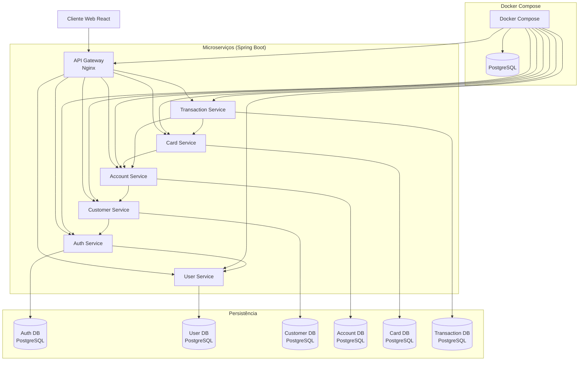

# Plano de Modernização MVP: AWS CardDemo (React, Java, PostgreSQL)

## Sumário Executivo

Este documento apresenta o plano para implementação de um Produto Mínimo Viável (MVP) da aplicação CardDemo modernizada. O MVP foi definido para entregar valor de negócio rapidamente enquanto estabelece a base arquitetural para a solução completa. O plano detalha o escopo, arquitetura, abordagem de implementação, estimativas de tempo e critérios de sucesso para este MVP.

## 1. Escopo do MVP

### 1.1. Definição do Escopo

O MVP da aplicação CardDemo modernizada focará em um subconjunto de funcionalidades essenciais que representam o núcleo do sistema, permitindo as operações básicas de gerenciamento de cartões de crédito:

#### 1.1.1. Funcionalidades Incluídas no MVP

1. **Autenticação e Segurança**
   - Login de usuários com ID e senha
   - Autorização baseada em papéis (admin e usuário regular)
   - Gestão básica de sessão com tokens JWT

2. **Gestão de Usuários**
   - Listagem de usuários (para administradores)
   - Criação de novos usuários (para administradores)
   - Atualização de dados de usuários existentes

3. **Gestão de Clientes**
   - Listagem e busca de clientes
   - Visualização detalhada de clientes
   - Criação e atualização de clientes

4. **Gestão de Contas**
   - Listagem de contas
   - Visualização de detalhes de conta (saldo, limite, status)
   - Atualização de informações básicas de conta

5. **Gestão de Cartões**
   - Listagem de cartões associados a contas
   - Visualização de detalhes de cartões
   - Atualização de status de cartões (ativar/desativar)

6. **Transações Básicas**
   - Listagem de transações por cartão/conta
   - Visualização de detalhes de transações
   - Registro manual de novas transações

#### 1.1.2. Funcionalidades Excluídas do MVP (para fases futuras)

1. **Processamento Batch Avançado**
   - Cálculo de juros
   - Geração automatizada de extratos

2. **Recursos Analíticos**
   - Dashboards complexos
   - Relatórios personalizados
   - Análises preditivas

3. **Detecção de Fraude**
   - Regras avançadas de identificação de fraude
   - Alertas automáticos

4. **APIs Externas**
   - Integração com sistemas de terceiros
   - Webhooks para notificações

5. **Características Avançadas**
   - Suporte multi-moeda
   - Tokenização de cartões
   - Programas de recompensas

### 1.2. Justificativa para a Seleção de Funcionalidades

As funcionalidades selecionadas para o MVP foram escolhidas com base nos seguintes critérios:

1. **Valor de Negócio**
   - Representam o core business da aplicação de cartão de crédito
   - Atendem às necessidades básicas dos usuários finais
   - Permitem operações essenciais do dia a dia

2. **Viabilidade Técnica**
   - Podem ser implementadas no prazo estabelecido
   - Estabelecem a base arquitetural para expansões futuras
   - Demonstram a eficácia da nova arquitetura

3. **Redução de Riscos**
   - Permitem validar os principais componentes técnicos
   - Cobrem os fluxos de negócio mais críticos
   - Facilitam a migração gradual de usuários

4. **Representatividade**
   - Abrangem diferentes aspectos do sistema (segurança, dados, transações)
   - Envolvem todos os principais microserviços da arquitetura alvo
   - Incluem tanto operações CRUD quanto regras de negócio básicas

## 2. Arquitetura Proposta para o MVP

### 2.1. Visão Geral da Arquitetura MVP

A arquitetura do MVP seguirá um modelo simplificado da arquitetura completa, mantendo a abordagem de microserviços mas com um conjunto reduzido de componentes. Esta arquitetura será extensível para acomodar os componentes adicionais nas fases posteriores.

#### 2.1.1. Componentes da Arquitetura MVP

1. **Frontend (React)**
   - Interface web responsiva
   - Implementação das telas essenciais
   - Comunicação com backend via REST APIs

2. **API Gateway (Nginx)**
   - Roteamento de requisições para os microserviços
   - Gerenciamento básico de CORS e segurança
   - Proxy reverso para os serviços backend

3. **Microserviços Core (Java Spring Boot)**
   - Implementação dos serviços essenciais
   - APIs REST padronizadas
   - Persistência em PostgreSQL

4. **Persistência (PostgreSQL)**
   - Banco de dados relacional para todos os serviços do MVP
   - Esquemas separados por domínio de serviço
   - Migração dos dados essenciais do sistema legado

5. **Infraestrutura (Docker e Docker Compose)**
   - Containerização de todos os componentes
   - Orquestração básica via Docker Compose
   - Configuração de desenvolvimento e produção

### 2.2. Microserviços Específicos do MVP

Para o MVP, implementaremos um subconjunto dos microserviços planejados para a versão completa:

1. **Auth Service**
   - Autenticação de usuários
   - Geração e validação de tokens JWT
   - Autorização básica baseada em papéis

2. **User Service**
   - Gestão de usuários do sistema
   - CRUD de perfis de usuário
   - Associação com papéis e permissões

3. **Customer Service**
   - Gestão de clientes
   - Dados pessoais e contatos
   - Associação com contas e cartões

4. **Account Service**
   - Gestão de contas de cartão de crédito
   - Limites, saldos e status
   - Relacionamento com clientes e cartões

5. **Card Service**
   - Gestão de cartões de crédito
   - Associação com contas
   - Status e informações de cartão

6. **Transaction Service**
   - Registro e consulta de transações
   - Associação com cartões e contas
   - Processamento básico de transações

### 2.3. Diagrama da Arquitetura do MVP

## 3. Fases de Modernização do MVP

A implementação do MVP será realizada em fases incrementais, cada uma entregando componentes funcionais que podem ser testados e validados:

### 3.1. Fase 1: Configuração de Infraestrutura (2 semanas)

- Setup do ambiente de desenvolvimento
- Configuração de Docker e Docker Compose
- Criação de repositórios Git
- Configuração do PostgreSQL
- Setup do Nginx como API Gateway
- Criação dos projetos base Spring Boot
- Configuração de CI/CD básico

### 3.2. Fase 2: Implementação de Autenticação e Usuários (3 semanas)

- Implementação do Auth Service
  - Mecanismo de login/logout
  - Geração e validação de tokens JWT
  - Controle de sessão básico
- Implementação do User Service
  - CRUD de usuários
  - Gestão de perfis e papéis
  - Integração com Auth Service
- Implementação das telas de frontend correspondentes
  - Tela de login
  - Gestão de usuários (admin)
  - Perfil de usuário

### 3.3. Fase 3: Implementação do Core de Negócio (4 semanas)

- Implementação do Customer Service
  - CRUD de clientes
  - Pesquisa e listagem
  - Associações básicas
- Implementação do Account Service
  - CRUD de contas
  - Regras de negócio para limites e saldos
  - Associações com clientes
- Implementação do Card Service
  - CRUD de cartões
  - Associação com contas
  - Gestão de status
- Implementação das telas de frontend correspondentes
  - Listagem e detalhes de clientes
  - Gestão de contas
  - Gestão de cartões

### 3.4. Fase 4: Implementação de Transações (3 semanas)

- Implementação do Transaction Service
  - Registro de transações
  - Consultas e listagens
  - Impacto básico em saldos
- Integração com Account e Card Services
- Implementação das telas de frontend correspondentes
  - Listagem de transações
  - Detalhes de transação
  - Registro de nova transação

### 3.5. Fase 5: Integração, Testes e Migração (3 semanas)

- Integração final entre todos os serviços
- Testes de integração end-to-end
- Migração de dados do sistema legado
- Ajustes de performance e usabilidade
- Preparação para deploy em produção
- Documentação e treinamento básico

## 4. Estimativas de Tempo de Desenvolvimento do MVP

### 4.1. Estimativa por Fase

| Fase | Descrição | Duração (semanas) |
|------|-----------|-------------------|
| 1 | Configuração de Infraestrutura | 2 |
| 2 | Implementação de Autenticação e Usuários | 3 |
| 3 | Implementação do Core de Negócio | 4 |
| 4 | Implementação de Transações | 3 |
| 5 | Integração, Testes e Migração | 3 |
| **Total** | | **15 semanas** |

### 4.2. Estimativa por Componente

| Componente | Escopo | Estimativa (semanas) |
|------------|--------|----------------------|
| Frontend React | Telas para todas as funcionalidades do MVP | 5 |
| Auth Service + User Service | Autenticação, autorização e gestão de usuários | 3 |
| Customer Service | Gestão completa de clientes | 2 |
| Account Service | Gestão de contas e suas regras | 2.5 |
| Card Service | Gestão de cartões e suas regras | 2 |
| Transaction Service | Registro e consulta de transações | 2.5 |
| API Gateway (Nginx) | Configuração, roteamento, segurança | 1 |
| Docker/Docker Compose | Containerização e orquestração | 1 |
| Testes e Integração | Testes de integração, E2E, ajustes | 3 |
| **Total** | (com desenvolvimento paralelo) | **15 semanas** |

### 4.3. Cronograma Resumido

- **Semanas 1-2**: Configuração de infraestrutura
- **Semanas 3-5**: Implementação de autenticação e usuários
- **Semanas 6-9**: Implementação do core de negócio
- **Semanas 10-12**: Implementação de transações
- **Semanas 13-15**: Integração, testes e migração
- **Semana 16**: Go-live do MVP

## 5. Detalhes Técnicos da Migração para o MVP

### 5.1. Foco na Migração de Dados e Lógica

#### 5.1.1. Estratégia de Migração de Dados para o MVP

Para o MVP, a migração de dados focará apenas nos dados essenciais para as funcionalidades incluídas:

1. **Dados de Usuário**
   - Migração da tabela USRSEC do sistema legado
   - Transformação para o novo modelo de usuários
   - Atualização de senhas para formato seguro (hash+salt)

2. **Dados de Cliente**
   - Migração seletiva de CUSTDATA
   - Foco em clientes ativos e com dados completos
   - Normalização para o novo modelo relacional

3. **Dados de Conta**
   - Migração seletiva de ACCTDATA
   - Priorização de contas ativas
   - Cálculo e validação de saldos atuais

4. **Dados de Cartão**
   - Migração seletiva de CARDDATA
   - Associação com contas migradas
   - Validação de dados sensíveis (números de cartão, etc.)

5. **Dados de Transação**
   - Migração limitada (últimos 3-6 meses)
   - Priorização de transações relevantes para saldos atuais
   - Associação com cartões e contas migrados

#### 5.1.2. Processo de Migração

1. **Extração**
   - Scripts para extração de dados dos arquivos VSAM
   - Conversão para formato intermediário (JSON/CSV)
   - Validação de integridade dos dados extraídos

2. **Transformação**
   - Mapeamento para o novo modelo de dados
   - Limpeza e padronização
   - Geração de identificadores consistentes
   - Estabelecimento de relações entre entidades

3. **Carregamento**
   - Scripts SQL para carga no PostgreSQL
   - Validação de integridade referencial
   - Verificação de contagens e totais de controle

4. **Validação**
   - Comparação de registros críticos com o sistema legado
   - Validação de saldos e totais financeiros
   - Verificação de amostra de registros por usuários de negócio

#### 5.1.3. Ferramentas para Migração

- Scripts Java/Python para extração e transformação
- Arquivos CSV/JSON como formato intermediário
- Scripts SQL para carga no PostgreSQL
- Ferramentas de validação customizadas

### 5.2. Abordagem para Migração da Lógica de Negócio

Para o MVP, focaremos na migração das regras de negócio essenciais:

1. **Autenticação e Autorização**
   - Reimplementação do fluxo de login (COSGN00C)
   - Modernização com JWT e Spring Security
   - Manutenção da lógica de perfis de acesso

2. **Gestão de Clientes e Contas**
   - Reimplementação das regras de CRUD
   - Preservação das validações essenciais
   - Simplificação de fluxos complexos

3. **Regras de Cartões**
   - Migração das regras de associação cartão-conta
   - Implementação das regras de status
   - Manutenção das validações básicas

4. **Processamento de Transações**
   - Reimplementação das regras básicas de registro
   - Simplificação do processamento batch
   - Foco no impacto em saldos

#### 5.2.1. Tratamento de Casos Específicos

| Componente Original | Abordagem no MVP | Técnica |
|---------------------|------------------|---------|
| COSGN00C (Login) | Reimplementação completa | Spring Security + JWT |
| COACTVWC/COACTUPC (Contas) | Migração das regras essenciais | Spring Boot Service + JPA |
| COCRDLIC/COCRDUPC (Cartões) | Simplificação e reimplementação | API REST + serviços |
| COTRN00C/COTRN01C (Transações) | Foco nas consultas e registro básico | JPQL/Queries + REST |

## 6. Requisitos Funcionais do MVP

### 6.1. Autenticação e Segurança

- **RF-MVP-01**: O sistema deve permitir login com ID e senha
- **RF-MVP-02**: O sistema deve validar credenciais contra o banco de dados de usuários
- **RF-MVP-03**: O sistema deve distinguir entre usuários regulares e administradores
- **RF-MVP-04**: O sistema deve emitir tokens JWT para sessões autenticadas
- **RF-MVP-05**: O sistema deve controlar acesso a funcionalidades com base no perfil

### 6.2. Gestão de Usuários

- **RF-MVP-06**: Administradores devem poder listar todos os usuários do sistema
- **RF-MVP-07**: Administradores devem poder criar novos usuários
- **RF-MVP-08**: Administradores devem poder atualizar dados de usuários existentes
- **RF-MVP-09**: Usuários devem poder visualizar e editar seu próprio perfil
- **RF-MVP-10**: O sistema deve validar dados de usuário durante criação/atualização

### 6.3. Gestão de Clientes

- **RF-MVP-11**: O sistema deve permitir pesquisa e listagem de clientes
- **RF-MVP-12**: O sistema deve exibir detalhes completos de um cliente
- **RF-MVP-13**: Usuários autorizados devem poder criar novos clientes
- **RF-MVP-14**: Usuários autorizados devem poder atualizar dados de clientes
- **RF-MVP-15**: O sistema deve validar dados de cliente durante criação/atualização

### 6.4. Gestão de Contas

- **RF-MVP-16**: O sistema deve permitir listagem de contas por cliente
- **RF-MVP-17**: O sistema deve exibir detalhes de uma conta (saldo, limite, status)
- **RF-MVP-18**: Usuários autorizados devem poder criar novas contas
- **RF-MVP-19**: Usuários autorizados devem poder atualizar informações de contas
- **RF-MVP-20**: O sistema deve validar limites de crédito e status durante atualizações

### 6.5. Gestão de Cartões

- **RF-MVP-21**: O sistema deve listar cartões associados a uma conta
- **RF-MVP-22**: O sistema deve exibir detalhes de um cartão
- **RF-MVP-23**: Usuários autorizados devem poder criar novos cartões
- **RF-MVP-24**: Usuários autorizados devem poder atualizar status de cartões
- **RF-MVP-25**: O sistema deve validar a associação cartão-conta

### 6.6. Transações

- **RF-MVP-26**: O sistema deve listar transações por cartão/conta
- **RF-MVP-27**: O sistema deve exibir detalhes de uma transação
- **RF-MVP-28**: Usuários autorizados devem poder registrar novas transações
- **RF-MVP-29**: O sistema deve atualizar saldos de conta após registro de transação
- **RF-MVP-30**: O sistema deve validar transações contra limites disponíveis

## 7. Requisitos Não Funcionais do MVP

### 7.1. Performance

- **RNF-MVP-01**: As APIs REST devem responder em menos de 500ms para 95% das requisições
- **RNF-MVP-02**: O sistema deve suportar pelo menos 100 usuários concorrentes
- **RNF-MVP-03**: As listagens devem suportar paginação eficiente
- **RNF-MVP-04**: O frontend deve carregar em menos de 3 segundos em condições normais

### 7.2. Segurança

- **RNF-MVP-05**: Todas as comunicações devem usar HTTPS/TLS
- **RNF-MVP-06**: Senhas devem ser armazenadas com hash seguro (bcrypt)
- **RNF-MVP-07**: Tokens JWT devem expirar em 30 minutos
- **RNF-MVP-08**: Dados sensíveis (números de cartão, etc.) devem ser mascarados na UI
- **RNF-MVP-09**: O sistema deve implementar proteção básica contra XSS e CSRF

### 7.3. Usabilidade

- **RNF-MVP-10**: A interface deve ser responsiva (desktop e tablet)
- **RNF-MVP-11**: A navegação deve seguir padrões consistentes
- **RNF-MVP-12**: Mensagens de erro devem ser claras e acionáveis
- **RNF-MVP-13**: A UI deve fornecer feedback para ações do usuário

### 7.4. Disponibilidade

- **RNF-MVP-14**: O sistema deve ter disponibilidade de 99.5% durante horário comercial
- **RNF-MVP-15**: Manutenções planejadas devem ser possíveis com downtime mínimo

### 7.5. Escalabilidade

- **RNF-MVP-16**: A arquitetura deve suportar escalabilidade horizontal futura
- **RNF-MVP-17**: O banco de dados deve suportar crescimento para até 10GB de dados no MVP

### 7.6. Manutenibilidade

- **RNF-MVP-18**: O código deve seguir padrões e convenções documentados
- **RNF-MVP-19**: Cada microserviço deve ter pelo menos 70% de cobertura de testes unitários
- **RNF-MVP-20**: As APIs devem ser documentadas com OpenAPI/Swagger

### 7.7. Compatibilidade

- **RNF-MVP-21**: O frontend deve ser compatível com as versões recentes dos principais navegadores
- **RNF-MVP-22**: O backend deve ser compatível com Java 17 ou superior
- **RNF-MVP-23**: O sistema deve suportar PostgreSQL 14 ou superior

## 8. Casos de Testes do MVP

### 8.1. Testes Essenciais para Validar o MVP

#### 8.1.1. Testes de Autenticação e Segurança

1. **Login com Credenciais Válidas**
   - Verificar acesso bem-sucedido com credenciais corretas
   - Verificar geração de token JWT
   - Verificar redirecionamento para dashboard apropriado

2. **Tentativas de Login Inválidas**
   - Verificar mensagens de erro para credenciais incorretas
   - Verificar comportamento após múltiplas tentativas falhas

3. **Autorização de Funcionalidades**
   - Verificar acesso a recursos com diferentes perfis
   - Verificar bloqueio de acesso não autorizado
   - Testar separação entre funções admin e usuário regular

#### 8.1.2. Testes de Gestão de Usuários

1. **CRUD de Usuários**
   - Criar novos usuários com diferentes perfis
   - Atualizar informações de usuários existentes
   - Listar e filtrar usuários

2. **Validações de Dados de Usuário**
   - Testar restrições de formato e obrigatoriedade
   - Verificar unicidade de ID de usuário
   - Testar regras de senha (complexidade, etc.)

#### 8.1.3. Testes de Gestão de Clientes e Contas

1. **CRUD de Clientes**
   - Criar novos clientes com dados completos
   - Atualizar informações de clientes
   - Pesquisar e filtrar clientes

2. **CRUD de Contas**
   - Criar contas associadas a clientes
   - Atualizar limites e status de contas
   - Verificar relações entre contas e clientes

#### 8.1.4. Testes de Gestão de Cartões

1. **CRUD de Cartões**
   - Criar cartões associados a contas
   - Atualizar status de cartões
   - Listar cartões por conta

2. **Validações de Cartões**
   - Verificar regras de associação cartão-conta
   - Testar restrições de número de cartões por conta
   - Verificar formatação e validação de dados de cartão

#### 8.1.5. Testes de Transações

1. **Registro de Transações**
   - Registrar transações para diferentes cartões
   - Verificar impacto no saldo da conta
   - Testar validações contra limite disponível

2. **Consulta de Transações**
   - Listar transações por cartão/conta
   - Filtrar transações por período/tipo
   - Verificar cálculos de totais e agrupamentos

#### 8.1.6. Testes de Integração

1. **Fluxos Completos de Negócio**
   - Criar cliente → criar conta → criar cartão → registrar transações
   - Atualizar limites → verificar impacto em novas transações
   - Desativar cartão → verificar bloqueio de novas transações

2. **Consistência de Dados**
   - Verificar integridade referencial entre entidades
   - Testar consistência após operações encadeadas
   - Validar cálculos financeiros (saldos, totais)

### 8.2. Abordagem de Testes

- **Testes Unitários**: Para componentes individuais (serviços, controllers)
- **Testes de Integração**: Para interações entre serviços
- **Testes de API**: Para validar endpoints REST
- **Testes de UI**: Para fluxos de usuário no frontend
- **Testes Manuais**: Para validação final de UX e fluxos complexos

## 9. Gestão de Projeto Ágil para o MVP

### 9.1. Épicos do MVP

#### EP-MVP-01: Infraestrutura e Configuração Básica
- Configuração do ambiente de desenvolvimento
- Setup da infraestrutura Docker
- Configuração do Nginx como API Gateway
- Setup do PostgreSQL

#### EP-MVP-02: Autenticação e Gestão de Usuários
- Implementação do Auth Service
- Implementação do User Service
- UI para login e gestão de usuários

#### EP-MVP-03: Gestão de Clientes
- Implementação do Customer Service
- UI para pesquisa e manutenção de clientes
- Integrações com outros serviços

#### EP-MVP-04: Gestão de Contas e Cartões
- Implementação do Account Service
- Implementação do Card Service
- UI para gestão de contas e cartões

#### EP-MVP-05: Transações
- Implementação do Transaction Service
- UI para visualização e registro de transações
- Lógica de atualização de saldos

#### EP-MVP-06: Integração e Deploy
- Testes de integração completos
- Migração de dados iniciais
- Preparação para deploy em produção

### 9.2. Estórias de Usuário do MVP

#### EP-MVP-01: Infraestrutura e Configuração Básica

- **US-MVP-01**: Como DevOps, quero configurar um ambiente Docker para todos os componentes do sistema
- **US-MVP-02**: Como desenvolvedor, quero configurar o Nginx como API Gateway para rotear requisições aos microserviços
- **US-MVP-03**: Como DBA, quero configurar o PostgreSQL com schemas separados para cada serviço
- **US-MVP-04**: Como DevOps, quero configurar um pipeline CI/CD básico para build e deploy

#### EP-MVP-02: Autenticação e Gestão de Usuários

- **US-MVP-05**: Como usuário, quero fazer login com meu ID e senha para acessar o sistema
- **US-MVP-06**: Como administrador, quero criar novos usuários com diferentes perfis
- **US-MVP-07**: Como administrador, quero listar e pesquisar usuários para gerenciamento
- **US-MVP-08**: Como usuário, quero atualizar minha própria senha para manter a segurança
- **US-MVP-09**: Como usuário, quero fazer logout para encerrar minha sessão

#### EP-MVP-03: Gestão de Clientes

- **US-MVP-10**: Como operador, quero pesquisar clientes por nome, ID ou outros critérios
- **US-MVP-11**: Como operador, quero visualizar informações detalhadas de um cliente
- **US-MVP-12**: Como operador, quero atualizar dados de um cliente existente
- **US-MVP-13**: Como operador, quero cadastrar um novo cliente no sistema

#### EP-MVP-04: Gestão de Contas e Cartões

- **US-MVP-14**: Como operador, quero visualizar todas as contas de um cliente
- **US-MVP-15**: Como operador, quero atualizar limites e status de uma conta
- **US-MVP-16**: Como operador, quero visualizar todos os cartões associados a uma conta
- **US-MVP-17**: Como operador, quero ativar ou desativar um cartão
- **US-MVP-18**: Como operador, quero emitir um novo cartão para uma conta existente

#### EP-MVP-05: Transações

- **US-MVP-19**: Como operador, quero visualizar o histórico de transações de um cartão
- **US-MVP-20**: Como operador, quero registrar uma nova transação manualmente
- **US-MVP-21**: Como operador, quero filtrar transações por período ou tipo
- **US-MVP-22**: Como operador, quero visualizar o impacto de transações no saldo da conta

#### EP-MVP-06: Integração e Deploy

- **US-MVP-23**: Como DevOps, quero migrar dados essenciais do sistema legado
- **US-MVP-24**: Como usuário de negócio, quero validar dados migrados para garantir consistência
- **US-MVP-25**: Como DevOps, quero configurar monitoramento básico para o sistema em produção

### 9.3. Estórias Técnicas do MVP

- **TS-MVP-01**: Como desenvolvedor, quero configurar um projeto base Spring Boot para cada microserviço
- **TS-MVP-02**: Como desenvolvedor, quero implementar autenticação JWT em Spring Security
- **TS-MVP-03**: Como desenvolvedor, quero configurar o Swagger/OpenAPI para documentação de APIs
- **TS-MVP-04**: Como desenvolvedor, quero implementar mapeamento objeto-relacional com JPA
- **TS-MVP-05**: Como desenvolvedor, quero configurar um projeto React com Material-UI para o frontend
- **TS-MVP-06**: Como DevOps, quero criar Dockerfiles para cada componente da aplicação
- **TS-MVP-07**: Como desenvolvedor, quero implementar validação de dados com Bean Validation
- **TS-MVP-08**: Como desenvolvedor, quero configurar testes unitários com JUnit e Mockito
- **TS-MVP-09**: Como desenvolvedor, quero implementar paginação e ordenação em listagens
- **TS-MVP-10**: Como desenvolvedor, quero configurar logging centralizado para todos os serviços

## 10. Outras Informações Pertinentes para o MVP

### 10.1. Critérios de Sucesso do MVP

1. **Funcionalidade**
   - Todas as funcionalidades essenciais implementadas e operacionais
   - Fluxos de negócio básicos completamente funcionais
   - Ausência de erros críticos ou bloqueantes

2. **Qualidade**
   - Cobertura de testes unitários de pelo menos 70%
   - Todos os testes de integração passando
   - UI responsiva e usável nos principais navegadores

3. **Performance**
   - Tempos de resposta dentro dos limites definidos nos requisitos não funcionais
   - Capacidade de suportar o número projetado de usuários concorrentes
   - Estabilidade sob carga normal

4. **Adoção**
   - Feedback positivo dos usuários-chave durante validações
   - Ausência de problemas de usabilidade críticos
   - Capacidade dos usuários de completar tarefas básicas sem assistência

5. **Técnicos**
   - Arquitetura comprovadamente extensível para fases futuras
   - Infraestrutura estável e resiliente
   - Documentação suficiente para continuidade do desenvolvimento

### 10.2. Estratégia de Go-Live

1. **Fase Piloto**
   - Implantação para um grupo restrito de usuários
   - Operação paralela com o sistema legado
   - Período de validação e ajustes

2. **Implantação Gradual**
   - Expansão para mais usuários por etapas
   - Monitoramento intensivo durante expansão
   - Suporte reforçado nas primeiras semanas

3. **Cutover Completo**
   - Transição completa após validação bem-sucedida
   - Manutenção do sistema legado em modo somente leitura
   - Comunicação clara do cronograma para todos os stakeholders

### 10.3. Considerações Específicas para o MVP

1. **Simplificações Aceitáveis**
   - Número reduzido de validações de negócio complexas
   - UI funcional, mas possivelmente sem todos os refinamentos
   - Relatórios básicos em vez de recursos analíticos avançados

2. **Áreas de Foco**
   - Estabilidade da infraestrutura
   - Segurança dos dados críticos
   - Usabilidade das funcionalidades essenciais
   - Performance em operações de alta frequência

3. **Limitações Conhecidas**
   - Ausência de processamento batch completo
   - Relatórios limitados
   - Ausência de recursos avançados de segurança
   - Integrações externas mínimas ou ausentes

### 10.4. Próximos Passos Após o MVP

1. **Avaliação e Feedback**
   - Coleta estruturada de feedback dos usuários
   - Análise de métricas de uso e performance
   - Identificação de gaps e oportunidades de melhoria

2. **Planejamento de Próximas Iterações**
   - Priorização de funcionalidades adicionais
   - Refinamento da arquitetura com base na experiência
   - Definição de roadmap para versões subsequentes

3. **Expansão da Base**
   - Ampliação para mais usuários
   - Inclusão de mais tipos de dados históricos
   - Expansão para casos de uso adicionais